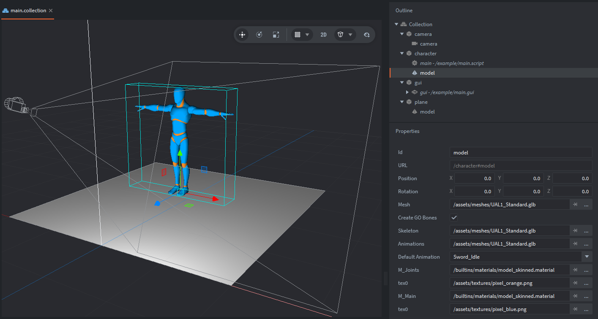

This example shows how to play skeletal animations from a skinned GLB model using `model.play_anim()`.

Click or tap any button to play the matching animation on the character. The selected button is dimmed to show the currently chosen animation.

The project uses a character from the [Quaternius Universal Animation Library](https://quaternius.itch.io/universal-animation-library).

## What You'll Learn

* How to play skeletal model animations with `model.play_anim()`
* How to use `model_skinned.material` for animated skinned models
* How to build a simple GUI animation picker
* How to detect GUI button clicks with `gui.pick_node()`
* How to send animation commands from a GUI script to a game object script with `msg.post()`

## Setup

The collection contains 4 game objects:

`character`
: Contains the model component and `main.script`. The model component uses the animated GLB model and the built-in `/builtins/materials/model_skinned.material`.

`gui`
: Contains `main.gui` and `main.gui_script`. The GUI contains one button for each animation clip. The button boxes are placed on the `boxes` layer, and the text labels are placed on the `texts` layer so the labels render above the boxes.

`plane`
: Contains a simple static model for the floor.

`camera`
: Contains a camera component to show the setup in game.



The model must use a skinned material. If the model uses `/builtins/materials/model.material`, the animation can be started in code, but the mesh will not visibly follow the skeleton. For skeletal animation, use `/builtins/materials/model_skinned.material`.

## How It Works

The standard free file version contains 45 animation clips, including idle, walk, jog, sprint, crouch, jump, swimming, spell, pistol, punch, and sword animations.
The GUI lists them as buttons. Clicking a button sends a message from the GUI script to the model script, which then plays the selected animation on the model component.

The model script owns animation playback. It defines a message id called `play_model_animation` and starts a default animation in `init()`:

```lua
local MSG_PLAY_MODEL_ANIMATION = hash("play_model_animation")
local DEFAULT_ANIMATION = hash("Sword_Idle")

local function play_animation(animation_id)
	model.play_anim("#model", animation_id, go.PLAYBACK_LOOP_FORWARD)
end

function init(self)
	play_animation(DEFAULT_ANIMATION)
end
```

When the script receives a `play_model_animation` message, it reads the animation id from the message and plays that animation on the local model component:

```lua
function on_message(self, message_id, message, sender)
	if message_id == MSG_PLAY_MODEL_ANIMATION then
		play_animation(message.animation_id)
	end
end
```

The GUI script owns the button list and input handling. It stores all animation names in an `ANIMATIONS` table. During `init()`, it finds the matching GUI nodes, sets the button text, and stores each button node together with its animation name.

The GUI script also acquires input focus:

```lua
msg.post(".", "acquire_input_focus")
```

When the user clicks or taps, `on_input()` checks every button with `gui.pick_node()`. If the pointer is inside a button, the GUI script sends a message to the model script:

```lua
msg.post(MODEL_SCRIPT, MSG_PLAY_MODEL_ANIMATION, {
	animation_id = hash(button.animation_id),
	animation_name = button.animation_id,
})
```

The GUI script does not call `model.play_anim()` directly. This keeps the GUI responsible only for interface and input, while the model game object remains responsible for model animation playback.

## Messages from GUI to Game objects

The GUI component and the model component live on different game objects. Instead of making the GUI script directly control the model component, the GUI sends a small command message:

```lua
play_model_animation
```

This is a common Defold pattern. The sender does not need to know how animation playback is implemented. It only sends the requested animation id. The receiver decides what to do with it.

This makes the example easy to extend. For example, the model script could later add animation blending, validation, transition rules, sound effects, or root motion handling without changing the GUI script.
