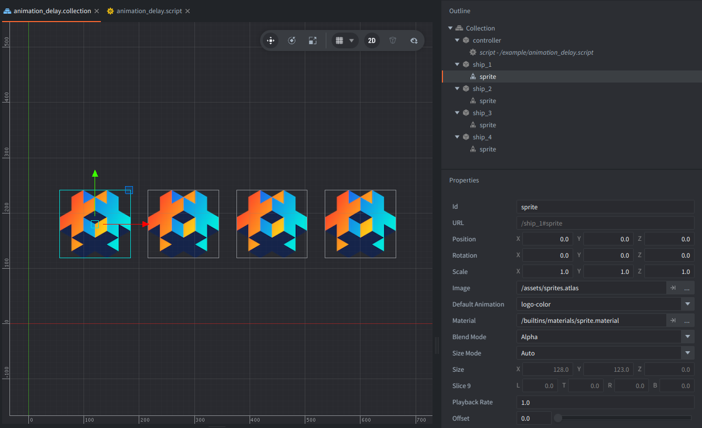

This example shows how to use the `delay` parameter of `go.animate()` (or `gui.animate()`) to create a wave effect.

## Setup

The collection contains four game objects aligned in a row next to each other. The additional `controller` game object has the script that starts one animation for each sprite.

## How It Works

Four game objects start the same `position.y` ping-pong animation, but each one begins slightly later than the previous sprite. The result is a simple wave that makes the `delay` argument easy to see.

The script stores the four target URLs in a table and loops over them with `ipairs()`. Each call to `go.animate()` uses the same target value, easing, duration, and playback mode.

The only thing that changes per sprite is the argument: `delay`. Multiplying the sprite index by `0.15` seconds offsets each start time just enough to produce a clear staggered wave.
