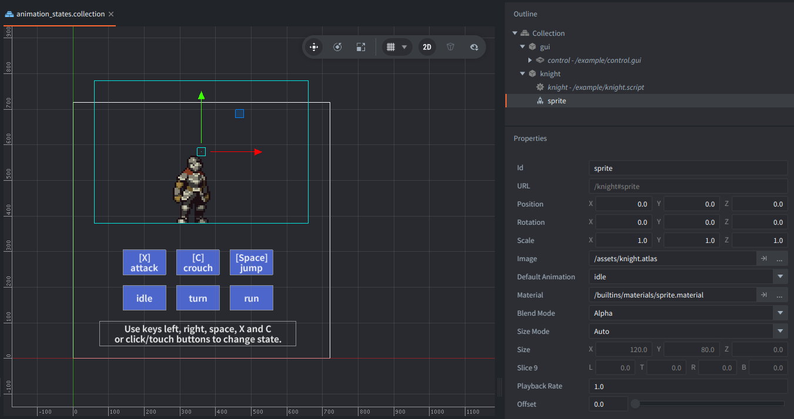
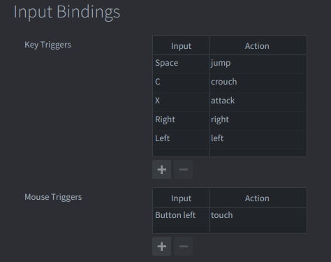
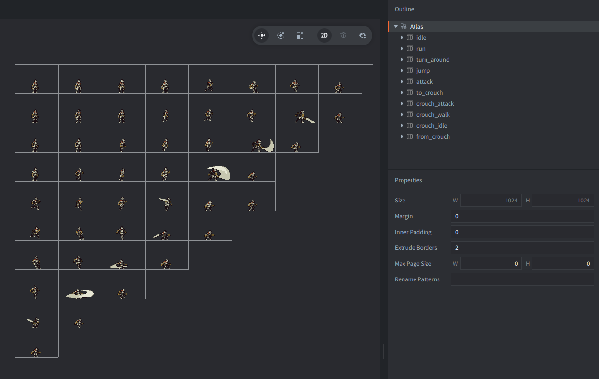

You can control the example in two ways:

- Use the keyboard: <kbd>Left</kbd>/<kbd>Right</kbd> arrow keys, <kbd>Space</kbd>, <kbd>X</kbd>, and <kbd>C</kbd>
- Click or touch the on-screen buttons: `idle`, `run`, `turn`, `jump`, `attack`, and `crouch`

The keyboard `C` key is a held crouch input. The GUI `crouch` button toggles crouch on and off.

This example shows how to build a small **Finite State Machine** (FSM) Lua module and use it in more than one place:

- animation states in `knight.script`
- locomotion states (`idle`, `run`) in `control.gui_script`
- posture states (`standing`, `crouching`) in `control.gui_script`

## What You'll Learn

- What Finite State Machines are
- How to create generic FSM logic in a reusable Lua module
- How to use multiple smaller FSMs for different control concerns
- How to combine several control states into one animation target
- How to insert intermediate animation states automatically

### Finite State Machines

A **Finite-State Machine** is a model with a finite set of possible states, one active state at a time, and explicit rules for moving from one state to another. FSMs are used in digital logic, software, and AI because they make behavior depend on clear state and transition rules.

Check also:
- [Simplest Lua Finite State Machine on lua-users.org](http://lua-users.org/wiki/FiniteStateMachine)
- [Lua Finite State Machine by Kyle Conroy](https://github.com/kyleconroy/lua-state-machine)
- [Lua FSM by unindented](https://github.com/unindented/lua-fsm)
- [Lua FSM by recih](https://github.com/recih/lua-fsm)
- ["Simple Lua FSM" video by Mahri2D](https://www.youtube.com/watch?v=aVFMDiaQ_Qc)
- ["How I think of state machines, coded in Defold" video by kags](https://www.youtube.com/watch?v=Hb3GEcTgkrg)

## Setup

The collection contains two game objects:

<kbd>gui</kbd>
: Contains `control.gui` and `control.gui_script`. This script owns input focus, handles keyboard and pointer input, and uses two FSMs: one for locomotion (`idle` / `run`) and one for posture (`standing` / `crouching`).

<kbd>knight</kbd>
: Contains the sprite and `knight.script`. This script owns the animation FSM. It stores the current animation state, validates transitions with the reusable FSM module, plays flipbooks, and notifies the GUI whenever the active animation changes.

## Input

The GUI stores raw input intent, then the locomotion and posture FSMs turn that intent into stable control states:

- locomotion FSM: `idle` or `run`
- posture FSM: `standing` or `crouching`

For keyboard movement, the most recently pressed direction key wins. That lets the turn animation finish and continue into a run as long as one movement key is still held.

The example uses these input bindings:

Key Triggers:

- <kbd>Space</kbd> - jump
- <kbd>C</kbd> - crouch
- <kbd>X</kbd> - attack
- <kbd>Right</kbd> - right
- <kbd>Left</kbd> - left

Mouse Triggers:

- <kbd>Button left</kbd> -touch (for left mouse clicks and touch input)

## How It Works

The example separates three different jobs:

### Reusable FSM module

`fsm.lua` contains the generic part:

- create a machine with `new()`
- read state with `get_state_name()` and `get_state()`
- perform direct transitions with `set_state()`
- find multi-step routes with `find_path()`

This keeps the reusable code small and focused.

### Animation FSM

The knight owns one animation FSM with states such as:

- `standing_idle`
- `standing_run`
- `standing_jump`
- `standing_turn`
- `crouching_idle`
- `crouching_run`
- `to_crouch`
- `to_standing`

When the requested animation is not directly reachable, the knight asks `fsm.find_path()` for a legal route and automatically inserts intermediate animation states. This keeps the controller states simple while still allowing animated transitions such as standing up or crouching down.

For example:

- `standing_idle` → `crouching_run` becomes `standing_idle` → `to_crouch` → `crouching_run`
- `crouching_run` → `standing_idle` becomes `crouching_run` → `to_standing` → `standing_idle`

### Control FSMs

The GUI owns two simpler FSMs:

- locomotion FSM: `idle` / `run`
- posture FSM: `standing` / `crouching`

These smaller machines are easier to understand than one larger controller state containing every combination directly.

The GUI combines them into one animation target for the knight:

- `standing` + `idle` -> `standing_idle`
- `standing` + `run` -> `standing_run`
- `crouching` + `idle` -> `crouching_idle`
- `crouching` + `run` -> `crouching_run`

The GUI sends stable looping targets with `set_target_state`. One-shot actions such as jump, attack, and turn are sent separately with `trigger_state`.

## Why Split It Like This?

Using several small FSMs keeps each machine focused on one question:

- locomotion asks: "idle or run?"
- posture asks: "standing or crouching?"
- animation asks: "which exact animation state should play now?"

That is often easier to read and maintain than one large state table that tries to represent every control and animation concern at once.

## Animation Atlas

The sprite component uses a flipbook atlas with the standing, crouching, attack, jump, and transition animations for the knight character.

> This example uses the Free Knight Character by Nauris "aamatniekss":
> https://aamatniekss.itch.io/fantasy-knight-free-pixelart-animated-character

