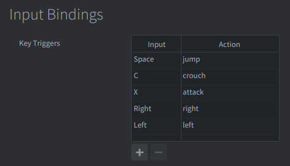

# A simple Finite State Machine for animations.

This example shows how to create a responsive character animation system using a **Finite State Machine (FSM)**. The character can smoothly transition between different states like idle, running, jumping, attacking, and crouching based on player input. This is a fundamental technique used in most 2D platformers and action games.

## What You'll Learn?

- How to implement a state machine for character animations
- How to handle complex input combinations and priorities## Key Concepts

**State Machine**: A design pattern where an object can be in only one state at a time, with clear rules for transitioning between states.

**Input Priority**: A system that determines which actions take precedence when multiple keys are pressed simultaneously.

**Animation Transitions**: Smooth changes between different animations, often with intermediate "transition" animations.## Key Concepts

**State Machine**: A design pattern where an object can be in only one state at a time, with clear rules for transitioning between states.

**Input Priority**: A system that determines which actions take precedence when multiple keys are pressed simultaneously.

**Animation Transitions**: Smooth changes between different animations, often with intermediate "transition" animations.
- How to create smooth transitions between animation states
- How to make sprites flip direction based on movement
- How to add visual effects (like jump animations)
- How to communicate between game objects using messages

## Setup

The example consists of two main game objects:

knight
: The animated character. Contains:
  - A *Sprite* component with the knight character image and animations.
  - A *Script* component (`knight.script`) that implements the state machine logic, handles input, and manages animation transitions.

gui
: The user interface. Contains:
  - A *GUI* component (`control.gui`) that has 6 nodes displaying states and text description for the example.
  - A *GUI Script* component (`control.gui_script`) that receives messages from the knight and updates the visual state indicators.

> **Note:**  
> The GUI in this example is not required for understanding the state machine logic, it only visually shows the active animation state. You can view the GUI source in the project files on Github still though.

## Animation Atlas

The sprite component uses a flipbook animation that is set up in an atlas:

> For this example we used the Free Knight Character by Nauris 'aamatniekss' available here: https://aamatniekss.itch.io/fantasy-knight-free-pixelart-animated-character

The atlas contains multiple animations for different character states:
- **idle**: Standing still animation
- **run**: Running animation (looped)
- **jump**: Jumping animation (plays once)
- **attack**: Attacking animation (plays once)
- **turn_around**: Turning animation (plays once)
- **crouch_idle**: Crouching idle anim **Note:** ation
- **crouch_walk**: Crouch walking animation
- **crouch_attack**: Crouch attacking animation
- **to_crouch**: Transition from standing to crouching
- **from_crouch**: Transition from crouching to standing

## Input Bindings

| Key             | Action                         |
|-----------------|--------------------------------|
| **Left Arrow / Right Arrow** | Move left/right   |
| **Space**       | Jump                           |
| **X**           | Attack                         |
| **C**           | Crouch (hold to stay crouched) |

## How It Works?

The character uses a **finite state machine** - a programming pattern where the character can only be in one "state" at a time. Each state can define certain things like:
- Which animation to play
- Whether the animation loops or plays once
- What happens when different keys are pressed
- What state to go to when the animation finishes

The system processes input with **priorities**: Attack > Jump > Movement > Crouch/Stand > Turning. This ensures that important actions (like attacking) can interrupt less important ones (like walking).

## Key Concepts

**State Machine**: A design pattern where an object can be in only one state at a time, with clear rules for transitioning between states.

**Input Priority**: A system that determines which actions take precedence when multiple keys are pressed simultaneously.

**Animation Transitions**: Smooth changes between different animations, often with intermediate "transition" animations.