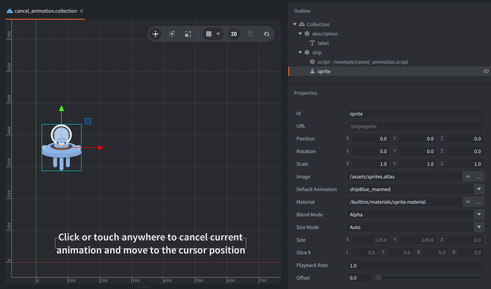

The collection contains two game objects:
- `ship` with one sprite and one script.
- `description` with a label for displaying the instructions text

## How It Works

The script starts an animation of movement along the X axis in `init()`. The ship starts moving to the right and back. Then it listens for input so it can interrupt that animation.

Clicking or tapping cancels the currently played animations immediately and starts a new one to move the ship toward the new x position instead.

When the player presses the mouse button or touches the screen, the script first calls [`go.cancel_animations()`](https://defold.com/ref/go-lua/index.html#go.cancel_animations:url-property). Defold stops the running tween and leaves the game object's position exactly where it was at that moment.

The script then calls [`go.animate()`](https://defold.com/ref/go-lua/index.html#go.animate:url-property-playback-to-easing-duration-delay-complete_function) again with the clicked x coordinate as the new target. Because the old animation was canceled first, the new tween starts from the ship's current position instead of jumping back to the original starting point.
