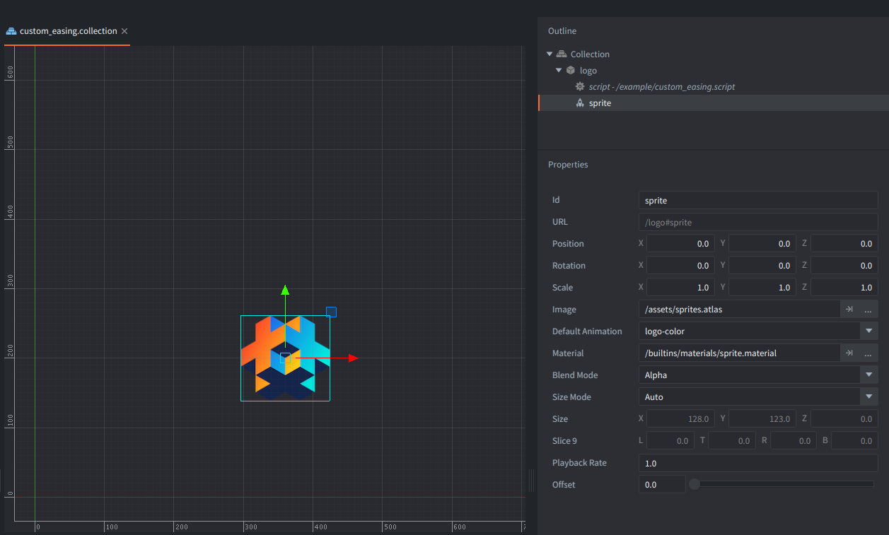

This example uses the square-wave easing curve. The logo alternates between its starting height and the target height, and the animation system interpolates the positions between the low and high positions when animating.

## Setup

The collection contains one game object with one sprite and one script. The script animates only the `position.y` property with the custom easing.

## How It Works

The script stores the custom easing samples in a plain Lua table and turns that table into a `vmath.vector`. Defold accepts that vector anywhere `go.animate()` (or `gui.animate()` in case of GUI animations) expects an easing value.

Because the vector is made of repeated blocks of `0` and `1`, the animation keeps snapping between the start value (start y position) and the target value (520 on Y axis, which is above the start value). That makes the easing behave like a square wave instead of a continuous curve. Note that the animation system still interpolates between the frames, so depending on time, the animation can be more trapezoidal or more square wave.
