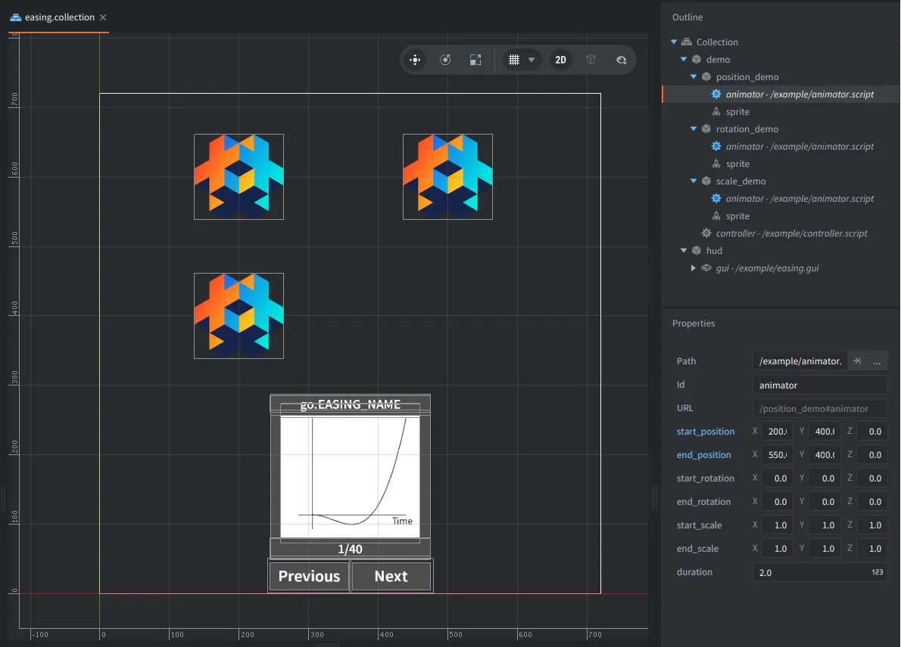

This example compares the built-in easing constants that can be passed to `go.animate()`. Use the left and right arrow keys, or the on-screen buttons, to switch easing function and restart the same position, rotation, and scale animations.

## What You'll Learn

- How to pass built-in `go.EASING_*` constants to `go.animate()`
- How `go.PLAYBACK_LOOP_PINGPONG` moves a property back and forth
- How one script can animate different transform properties through script property overrides
- How a controller can restart several game objects by sending messages

## Setup

The collection contains one controller, one HUD, and three animated logo game objects:

<kbd>demo</kbd>
: Contains `controller.script`. It owns the current easing index, listens for left and right arrow input, and sends restart messages to the animated game objects.

<kbd>position_demo</kbd>
: Contains a logo sprite and `animator.script`. Its script properties override the start and end positions.

<kbd>rotation_demo</kbd>
: Contains a logo sprite and `animator.script`. Its script properties override the end Euler rotation.

<kbd>scale_demo</kbd>
: Contains a logo sprite and `animator.script`. Its script properties override the end scale.

<kbd>hud</kbd>
: Contains the GUI that shows the easing name, the easing graph, and the previous/next buttons.

## How It Works

`controller.script` loads the table of easing constants from `easing_functions.lua`. When the selected index changes, it sends the chosen easing value to each animated game object in a `"restart"` message.

Each animated game object uses the same `animator.script`. The script exposes start and end values for position, Euler rotation, and scale. In the collection, each game object overrides only the values it needs, so the position demo moves, the rotation demo rotates, and the scale demo scales.

When `animator.script` receives a new easing value, it resets its game object to the configured start transform and starts a ping-pong property animation toward the configured end transform. The target values and duration stay the same while the selected easing constant changes the interpolation curve.

Read more about property animations in the [manual](https://defold.com/manuals/property-animation/).
