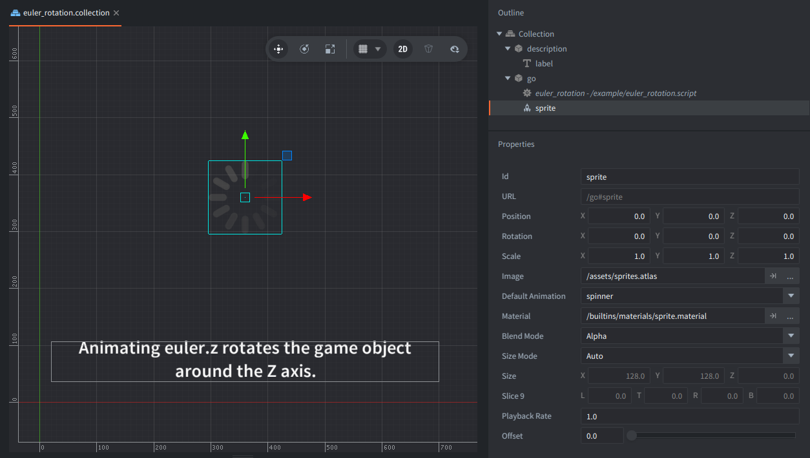

This example rotates a spinner sprite continuously by tweening one Euler angle. It uses the Z axis because that is the axis pointing out of the screen in a 2D scene.

## What You'll Learn

- How to animate a game object's Euler rotation
- Why `euler.z` is the useful axis for 2D rotation
- How looping playback and linear easing create constant motion

## Setup

The collection contains two game objects:

<kbd>go</kbd>
: Contains the sprite and `euler_rotation.script`. The sprite uses the `spinner` image from `sprites.atlas`, and the script animates only the game object's `euler.z` property.

<kbd>description</kbd>
: Contains the bottom description label. The label uses `/assets/text32.font`, a 32 px distance-field font, with `/builtins/fonts/label-df.material`.

## How It Works

`go.animate()` can animate numeric game object properties and sub-properties. Here it targets `"."`, the current game object, and `"euler.z"`, the Z component of the Euler rotation vector.

Euler angles are expressed in degrees, so the target value `-360` is one full clockwise turn. `go.PLAYBACK_LOOP_FORWARD` restarts the same two-second linear tween every time it finishes, keeping the spinner rotating at a constant speed.
