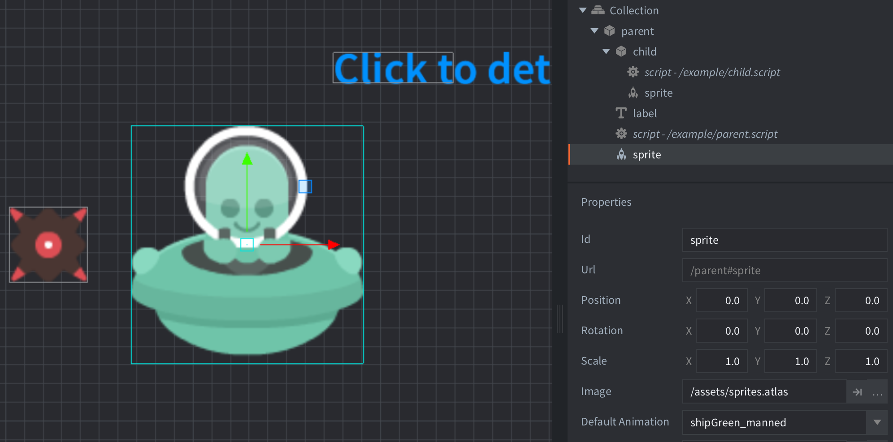

The parent/child relation is set up right in the editor by placing the parent and child game objects in the same collection and then simply dragging the child game object onto the parent.

Note that such a hierarchy must be created in a collection if you do it in the editor.