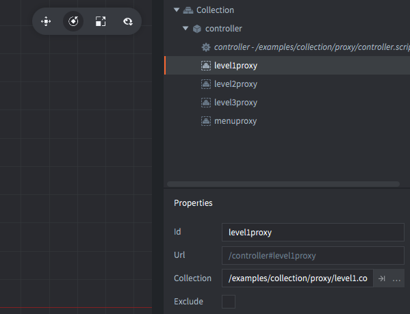

The setup consists of several collections and game objects.

proxy.collection
: This is the bootstrap collection specified in `game.project`. Contains:
  - A *Script* that handles loading and unloading of collection proxies
  - Four *Collection proxies* referencing a menu collection and three level collections.

menu.collection
: This collection contains a menu. Contains:
  - A *GUI* with some box and text nodes that acts as buttons.
  - A *GUI script* that handles the logic of clicking on the buttons and sending messages back to the proxy.collection.

level1-3.collection
: Collections representing the levels of a game. Contains:
  - *Script* with logic to send a message back to the proxy.collection to show the menu again.
