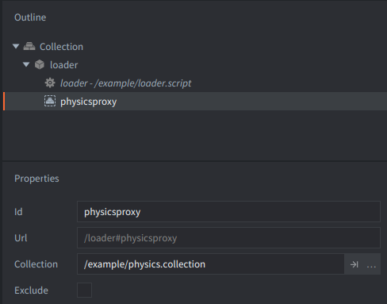

With the physics visualization on, all collision object shapes are visible. In addition, at intersections the normals at the collision points are shown.

The example collection consists of:
- 4 blocks with dynamic collision objects with Restituion 1.0, so they bounce forever,
- 4 walls with static collision objects forming boundaries for the blocks,
- game object `go` with:
  - label with example description,
  - a script `physics.script` included below.

This collection is additionally loaded via a `Collection Proxy` component in `main.collection`. Therefore, sending message `set_time_step` to its url `"main:/loader#physicsproxy"` is causing the proxy to have a different update time, causing e.g. the slow-motion effect, which might be helpful when debugging physics.

