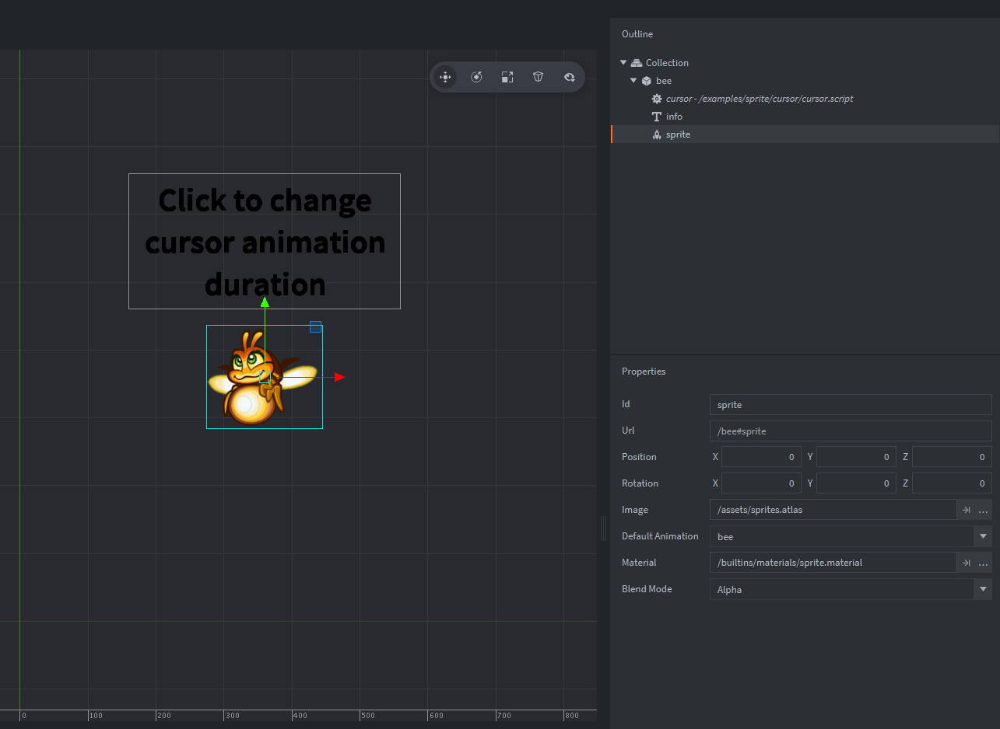

The example uses one game object with a sprite component and a label (to show the duration). The game object contains the script that sets and animates the normalized cursor value making the sprite's animation progress and shows the duration value on the label:

