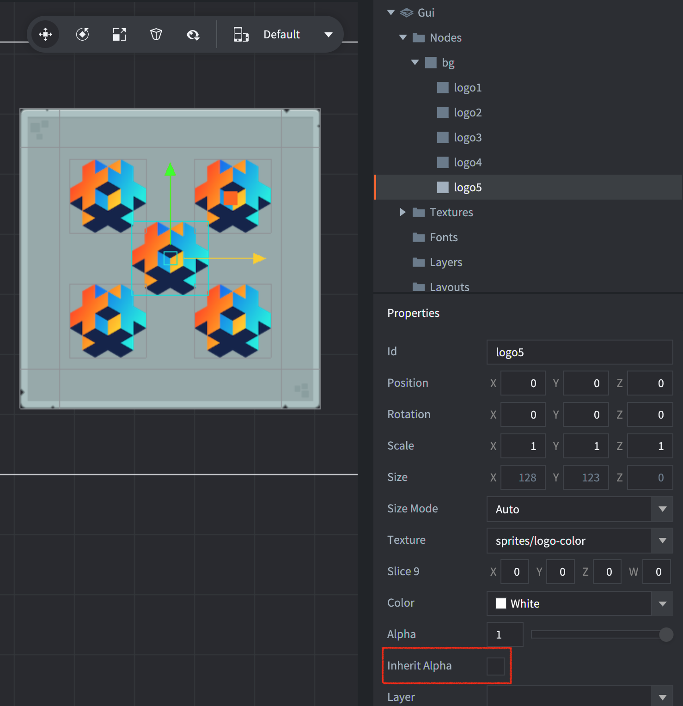

The example shows how to change the color of GUI nodes using `gui.set_color()` and `gui.animate()`.

Nodes will normally inherit the alpha of parent nodes, unless the Inherit Alpha checkbox is unchecked.

