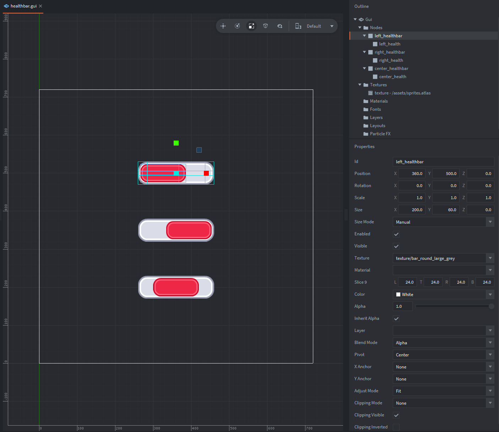
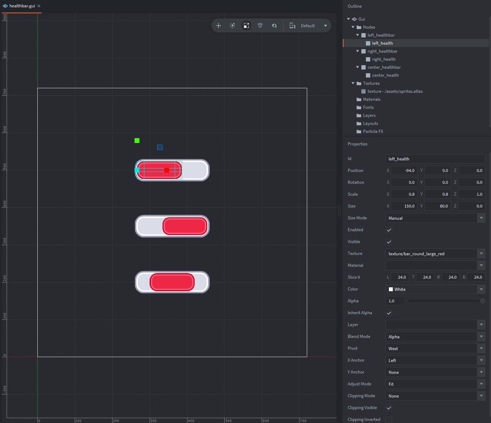
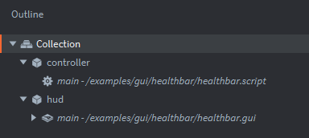

Overview : Example shows 3 pairs of nodes each forming a "health bar" with different pivots.

Create a pair of Box nodes, so that child node is smaller than the parent:

Example contains 3 such pairs - each with different `Pivot` and `X Anchor` settings for inner health bars:

- `West` + `Left`
- `East` + `Right`
- `Center` + `None`

Health is indicated as the size on X Axis of the inner node, so define what can be maximum and minimum width here.

Create a collection with such GUI component and add it and your game object with script to collection:

Example shows communication between `controller#main` script component (`healthbar.script`) and `hud#main` gui component with gui_script (`healthbar.gui_script`).