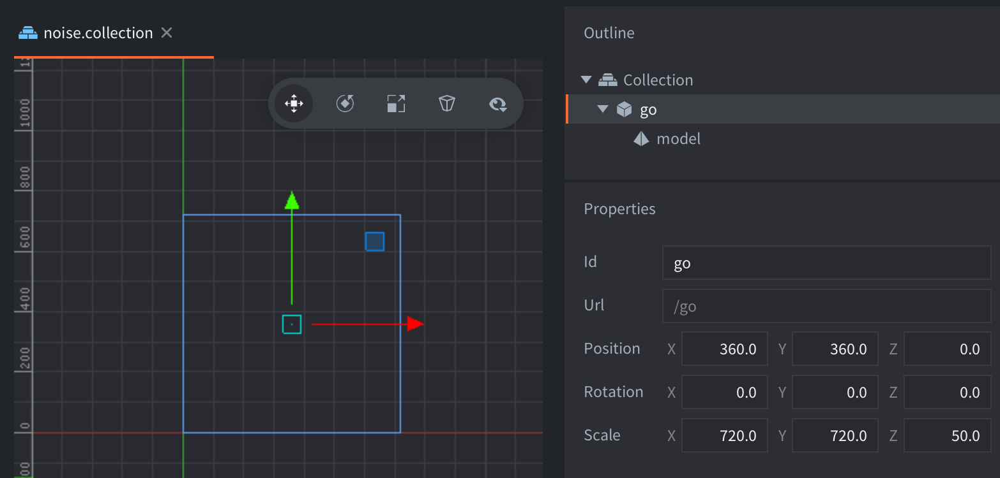

This example contains a game object with a model component. The model component uses the `/builtins/assets/meshes/quad.dae` mesh, which is a rectangule 1 by 1 unit large. The game object is scaled to the dimensions of the screen so that the mesh covers the entire screen.

The shader applies multiple layers of noise to the uv coordinate to create a two dimensional flowing cloud or smoke like look. The shader also receives a time value from `noise.script` and applies this in the calculation to apply movement to the visual effect.