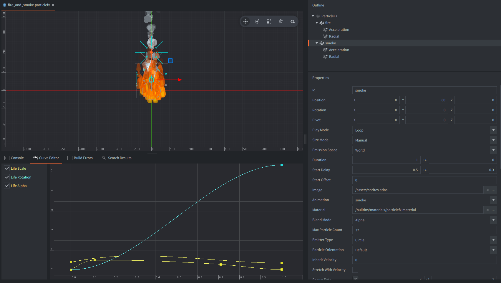

The particlefx consists of two emitters: for fire and smoke. Each of them has tweaked properties, images and modifiers. All combined creates a fire and smoke effect.

Fire emitter has a flame animation from sprites.atlas.
It is in front, because its Z position is 0.1, while smoke is at Z equal to 0.

It has two modifiers:
 - Acceleration with Magnitude 50 +/- 20
 - Radial with Magnitude: -50 +/- 20 positioned at Y = 150
 
Changed properties (from default):
 - Blend Mode: Alpha (for transparency blending)
 - Max Particle Count: 128
 - Emitter Type: Circle
 - Spawn Rate: 35 +/- 10
 - Emitter Size X: 100 +/- 20 (for circle emitters only Emitter Size X is taken into account, as radius)
 - Initial Speed: 30 +/- 20
 - Initial Size: 60 +/- 20
 - Initial Alpha: 0.8 +/- 0.2 (for a little transparency)
 - Initial Rotation: 180 (to make flame sprite upside down)
 
Additionally, the curves for Life Scale, Life Red, Life Green and Life Alpha properties were adjusted:

Smoke emitter has a smoke animation from sprites.atlas.

It has two modifiers:
 - Acceleration with Magnitude 20 +/- 10
 - Radial with Magnitude: -40 +/- 20 positioned at Y = 150
 
Changed properties (from default):
 - Position, Y: 60 (to emit a little bit above the fire)
 - Start Delay: 0.5 +/- 0.3 (to start a little bit after fire)
 - Blend Mode: Alpha (for transparency blending)
 - Max Particle Count: 32
 - Emitter Type: Circle
 - Spawn Rate: 4 +/- 2
 - Emitter Size X: 30 +/- 10  (for circle emitters only Emitter Size X is taken into account, as radius)
 - Particle Life Time: 5 +/- 0
 - Initial Speed: 10 +/- 10
 - Initial Size: 40 +/- 20
 - Initial Alpha: 0.5 +/- 0.3 (for a lot of transparency)
 - Initial Rotation: 0 +/- 90 (to make intial rotation of smoke sprite random)
 
 Additionally, the curves for Life Scale, Life Alpha and Life Rotation properties were adjusted:
 
 
