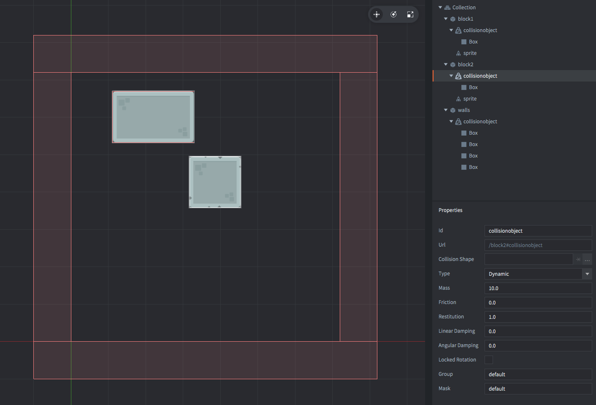

The setup consists of three game objects. The *game.project* physics *GravityY* property is set to -500 to match the scale of the setup.

block1
: The rectangular stone block. Contains:
  - A *Sprite* component with the stone block image.
  - A *Collision object* component. The *Type* is set to `DYNAMIC`, *Friction* is set to 0 and *Restitution* to 1.0 (it will bounce forever). A box *Shape* matching the sprite image is added to the components.

block2
: The square stone block. Contains:
  - A *Sprite* component with the stone block image.
  - A *Collision object* component. Also has *Type* set to `DYNAMIC`, *Friction* set to 0 and *Restitution* to 1.0. A box *Shape* matching the sprite image is added to the components.

walls
: The outer walls. Contains:
  - A *Collision object* component. The *Type* is set to `STATIC`. 4 box *Shapes* are added to the component. These are placed just outside of the game view.
