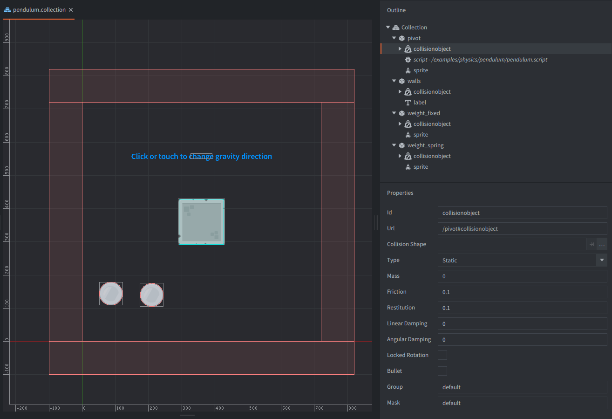

The setup consists of four game objects. The *game.project* physics *GravityY* property is set to -500 to match the scale of the setup.

pivot
: The square stone block. Contains:
  - A *Sprite* component with the stone block image.
  - A *Collision object* component. The *Type* is set to `STATIC`. A box *Shape* matching the sprite image is added to the components.
  - A script that joines the weights game objects to to the pivot and reacts to user input by changing the direction of the physics gravity.
  - A label with an instruction to the user.

weight_fixed
: The cirular metal weight. Contains:
  - A *Sprite* component with the metal circle image.
  - A *Collision object* component. Also has *Type* set to `DYNAMIC`. A box *Shape* matching the sprite image is added to the component.

weight_spring
: The same as above.

walls
: The outer walls. Contains:
  - A *Collision object* component. The *Type* is set to `STATIC`. 4 box *Shapes* are added to the component. These are placed just outside of the game view.
