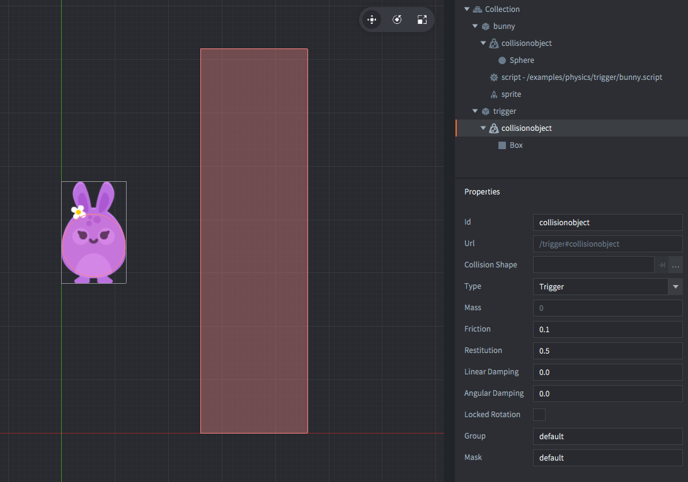

The setup consists of two game objects.

trigger
: The invisible trigger. Contains:
  - A *Collision object* component. The *Type* is set to `TRIGGER`. A box *Shape* is added to the components.

bunny
: The bunny. Contains:
  - A *Sprite* component with the bunny image.
  - A *Collision object* component. It has *Type* set to `DYNAMIC`. A sphere *Shape* matching the sprite image is added to the components.
  - A *Script* component that animates the bunny's position and reacts to physics messages when interacting with the trigger.

