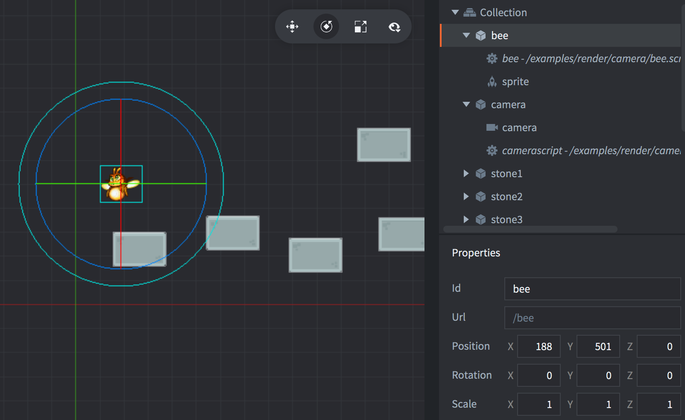

The setup consists of one `bee` game object that the camera can follow and one `camera` game object containing the camera component. The camera component will when active send view and projection updates to the render script.

bee
: The bee. Contains:
  - A *Sprite* component with the bee image.
  - A script that tells the camera whether it should follow the game object or not.

camera
: The camera. Contains:
  - A *Camera* component.
  - A script that controls the camera component.
