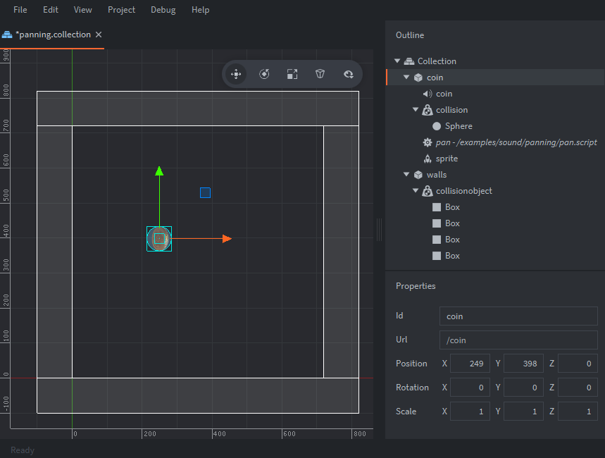

Overview : A coin bounces around the screen and on collision detection with the walls we get the coins x position then normalize that value for use in the sound components pan property. As the API states "The pan on the sound-component. The valid range is from -1.0 to 1.0, representing -45 degrees left, to +45 degrees right." we can use this information along with our x value from our coin object and normalize it into the correct range. 

The setup consists of a coin game object and walls for collision.

Coin
: contains:
  - A *Sound* component.
  - A *Collision* component. With *Type* set to `DYNAMIC` and a Sphere *Shape*.
  - A script used to set initial coin movement then set pan value and play a sound on collision.
  - A sprite component with default animation set as coin

Walls
: contains:
  - A *Collision* component set to `STATIC` and 4 box *Shapes* that make up the walls along the bounds of the game screen.
