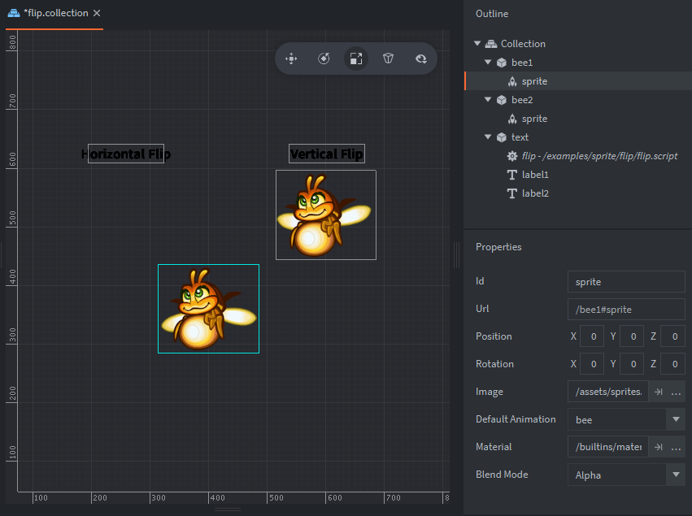

Overview :  [sprite.set_hflip](https://defold.com/ref/beta/sprite/#sprite.set_hflip:url-flip) & [sprite.set_vflip](https://defold.com/ref/beta/sprite/#sprite.set_vflip:url-flip) uses a boolean to set if a sprite animation should be flipped.

The setup consists of 2 bee game object's, another game object for text labels and a single script.

2 Game Object's
: containing:
  - A sprite with default animation set to bee
  
1 Game object
: contains:
 - A script
 - 2 text labels

Script
: use:
  - Sets sprite flip and go.animation for bee game objects.
