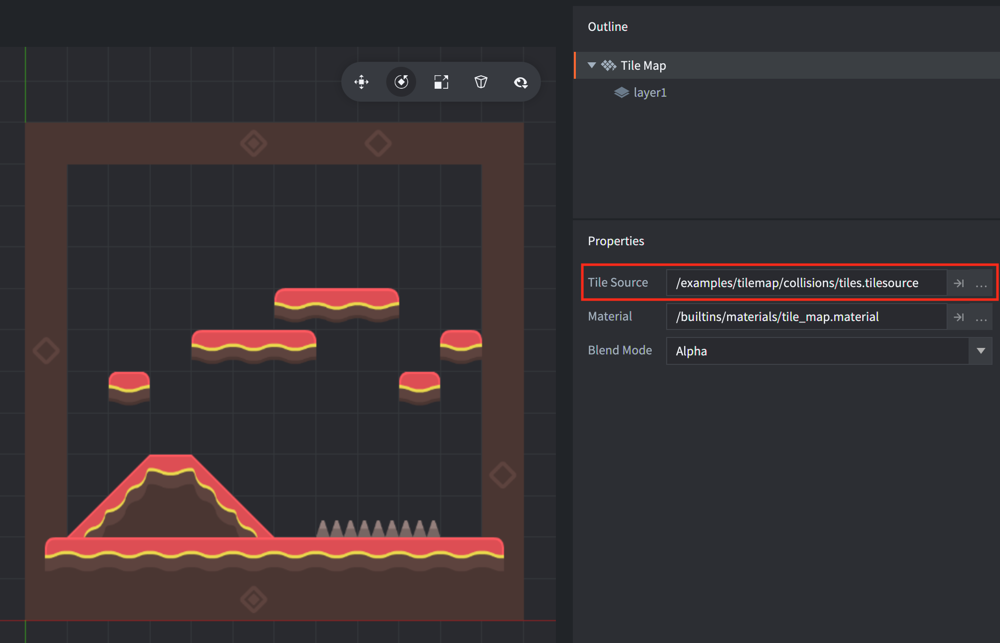
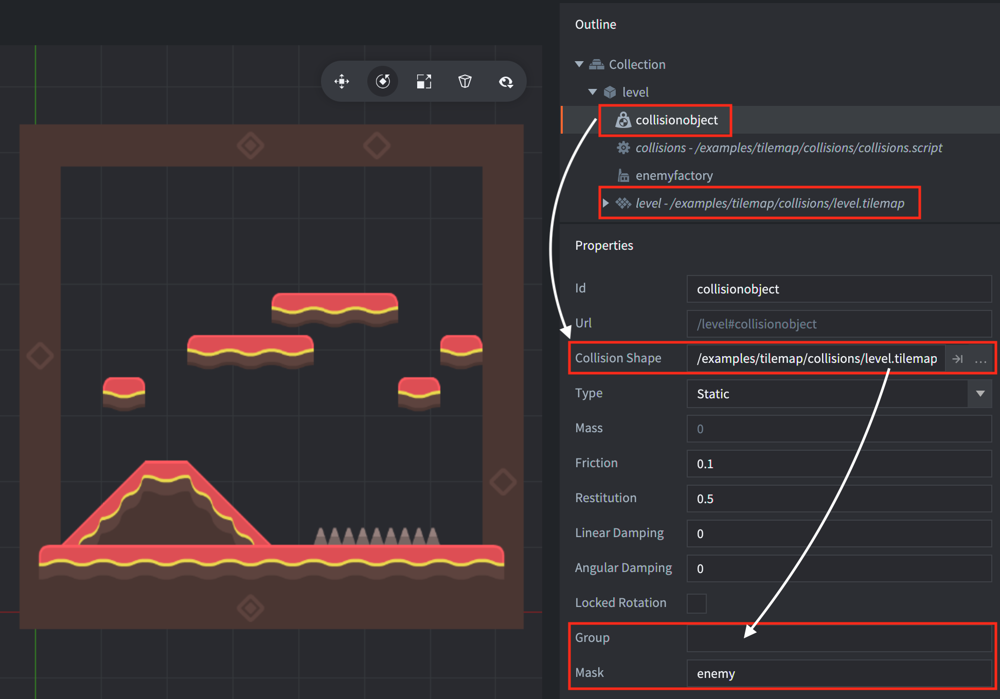

This example uses a tilesource with two collision groups: "ground" and "danger". The tilesource uses the `tilesheet_complete.png` image for the tiles and the collision shapes (traced as outlines around the transparent pixels of each tile).

The tiles belonging to the two groups have been "painted" as can be seen by the outline around each tile. The tiles belonging to the "danger" group are purple and the tiles belonging to the "ground" group are green. Tiles with a white outline does not belong to a collision group.

The tilemap component uses the tilesource:

The tilemap is added to the example together with a collision object which uses the tilemap itself as collision shape. Note that there is no need to specify any collsion groups on the collision object itself. The groups defined in the tilesource (ie "ground" and "danger") will be used:

Click/tap on the screen to spawn game objects that will fall and interact with the tilemap.

---

Tilemap and enemy graphics made by [Kenney](https://www.kenney.nl).
