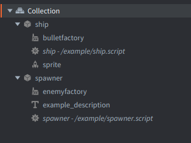

This example shows how to dynamically spawn enemy game objects using a factory component with different properties. The setup consists of three main components: a player ship, enemy spawner, and different enemy types with customizable properties.

Press keys `1`, `2`, or `3` to spawn different enemy types.

Example collection consists of 2 game objects:



### Ship
The red ship at the bottom that automatically moves and shoots. Consists of:
- A *Factory* component `bulletfactory` to spawn bullet game objects
- A *Script* `ship` that handles automatic movement (ping-pong animation) and bullet spawning every 0.25 seconds
- A *Sprite* component with the spaceship image

Bullets are simply animated upward and automatically deleted when they reach the top.

### Spawner
Controls enemy spawning with keyboard input. Consists of:
- A *Factory* `enemyfactory` to spawn enemies with different properties
- A *Label* `example_description` with instructions text displayed on top
- A *Script* `spawner` that spawns enemies.


The spawner script defines three different enemy types: `random`, `diagonal`, and `straight`.
Uses factory to create enemies with specific properties:

```lua
local properties = ENEMY_TYPES[enemy_type]
factory.create("#enemyfactory", position, nil, properties)
```

### Enemy Types

**Random Enemy** (Key 1):
- Green UFO sprite
- 1 health point
- Random horizontal movement that changes every second
- Speed: 40 horizontal, -100 vertical

**Diagonal Enemy** (Key 2):
- Red enemy sprite
- 2 health points
- Fixed diagonal movement
- Speed: 120 horizontal, -80 vertical

**Straight Enemy** (Key 3):
- Blue enemy sprite
- 3 health points
- Straight downward movement
- Speed: 0 horizontal, -40 vertical

### Enemy Script Properties
Properties defined in `enemy.script` control enemy behavior:
- `sprite` - Which sprite to display
- `health_points` - How many hits before destruction
- `speed` - Movement velocity vector
- `is_random` - Whether to use random movement changes

When enemies have `go.property` defined in their script, these properties are visible in the *Properties* pane and can be customized per enemy type.

Combine this example with other movement and physics examples to create a complete shoot'em up game!
