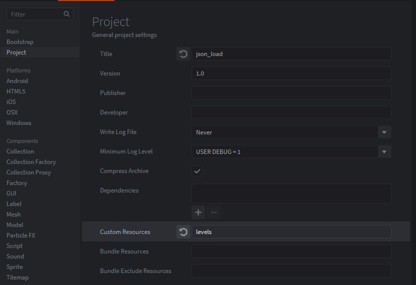

The example will load a json file. This can be useful for something like level data.

Before we can load a resource we need to tell Defold that we have custom resources.
We do this by changing the "custom resources" entry within our game.project file.

