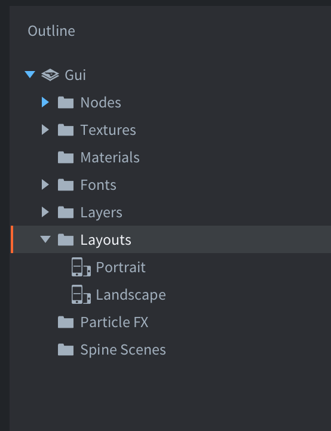
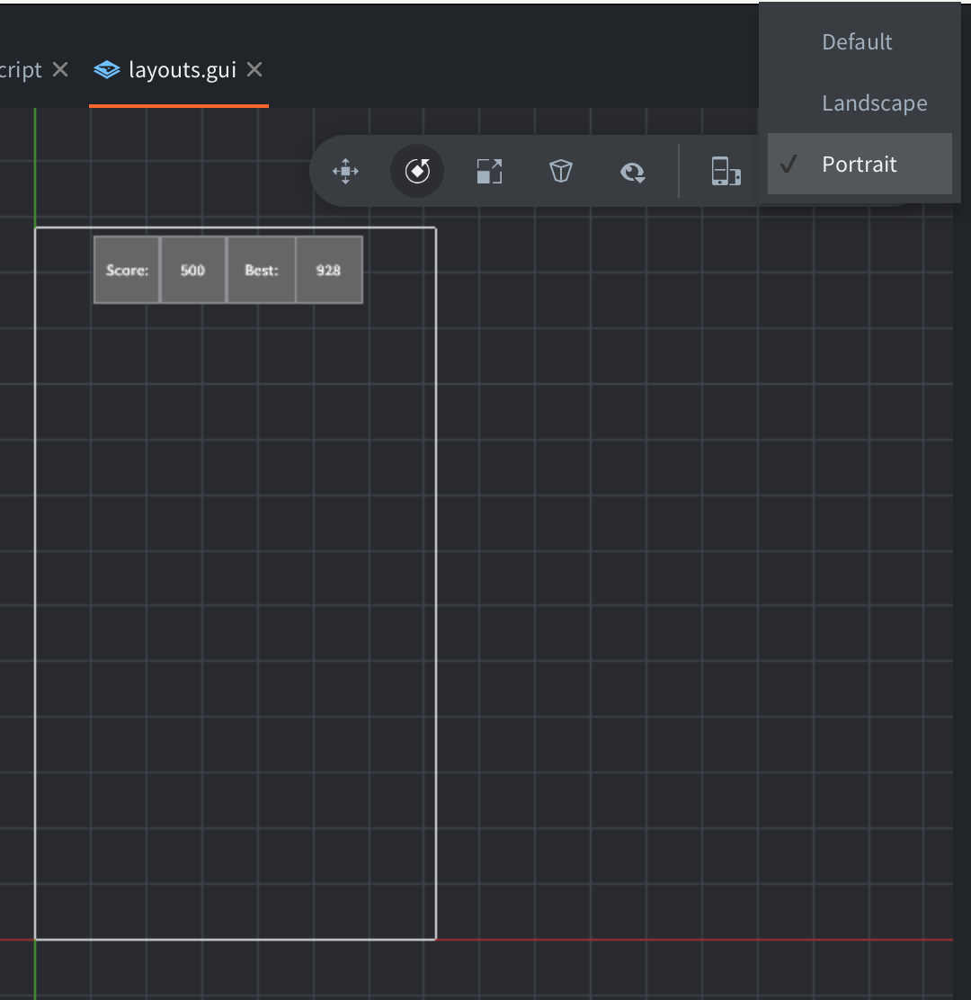
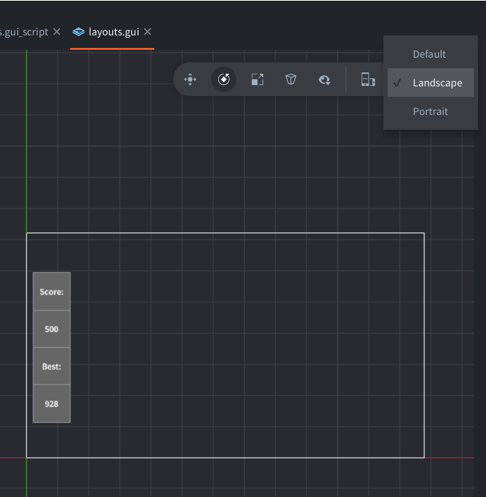

Overview : A small UI panel that changes its position depending on the screen size (canvas size in HTML5) using the Defold layouts system. [:More on Layouts with Defold:](https://defold.com/manuals/gui-layouts/#layouts)

Layouts are added in the GUI where we want to support them:

The panel is configured in both layouts, Portrait and Landscape:

