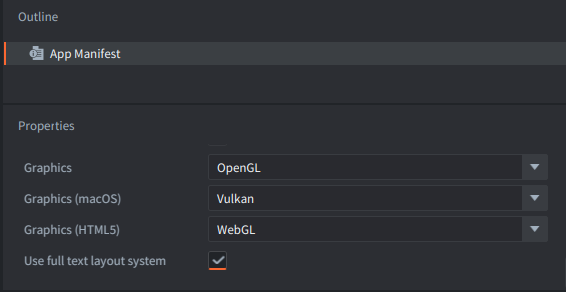
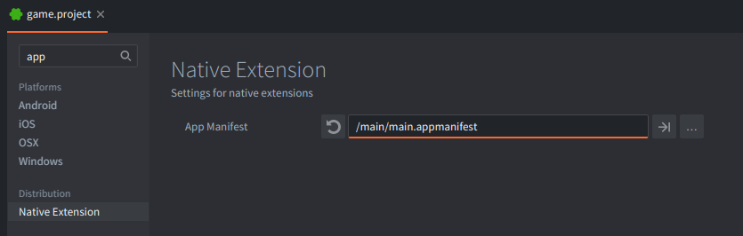
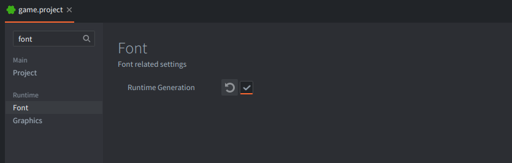
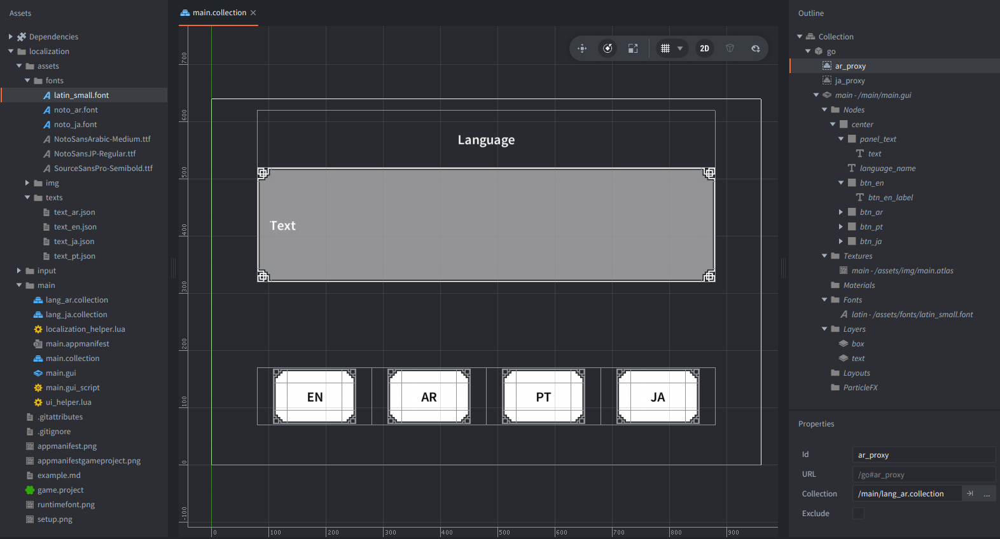

This example demonstrates how to handle localization in games, Unicode text layout, RTL rendering, and runtime font switching for localization.

Click the buttons (EN, AR, PT, JA) to switch between 4 languages.

Arabic demonstrates right-to-left layout, while English/Portuguese/Japanese show left-to-right layout.

## Approach overview

The example is intentionally modularized and the flow in the program is linear:

1. Read localized strings from a JSON file for the requested language.
2. If the language needs a non-default font, load the font collection proxy asynchronously.
3. Attach the font at runtime to the default GUI font resource.
4. Prewarm glyphs for the requested text so the first render is smooth.
5. Update the GUI text and layout (LTR/RTL) and restore input focus.

This illustrates a practical localization flow in Defold:

- Runtime font switching via `font.add_font()` / `font.remove_font()`.
- Asynchronous proxy loading for large font resources.
- Glyph prewarming with `font.prewarm_text()`.
- LTR/RTL layout using text node pivot and position.

To recreate such an example:

1. Add to your project an [App Manifest](https://defold.com/manuals/app-manifest/) file with the option `Use full font layout system` enabled. The rest of the settings doesn't matter for this example, so are left as default.

2. Use this App Manifest file in the `game.project` file in the `Native Extension` section in the `App Manifest` setting.

3. Then, also in the `game.project` file in the `Font` section enable the `Runtime Generation` setting.

Project setup used by this example:

- `game.project` with runtime font generation enabled and custom app manifest `main.appmanifest`.
- `main.collection` with:
    - game object `go` with:
        - `ar_proxy` - collection proxy component referring to `lang_ar.collection` file.
        - `ja_proxy` - collection proxy component referring to `lang_ja.collection` file.
        - `main.gui` - GUI component with `main.gui_script`.

The 2 mentioned collections (`lang_ar.collection` / `lang_ja.collection`) contain:
- `go` game object with:
    - `label` - component with `Font` property set to `noto_ar.font`/`noto_ja.font`

In the `assets` folder there are two subfolders:
- `fonts` - containing `.ttf` font files and `.font` Defold resources referencing those font files respectively
- `img` - containing images and atlas used for GUI nodes.
- `texts` - containing `.json` files with text examples and information about language used.

The separate Collections for components with fonts and Collection Proxies to load and unload them are added to show good practices on handling fonts - usually, you only need the one font that user selected in the settings, so rest of the fonts should be unloaded from memory.

Therefore, we have in the example only one font that is defined in the GUI component, that is `latin`. The rest (Arabic `noto_ar` and Japanese `noto_ja`) are loaded using respective Collection Proxy components `ar_proxy` and `ja_proxy`.

Those collections contain the game object with component in order to assign there a Font resource - `noto_ar` and `noto_ja`.

A [Collection Proxy](https://defold.com/manuals/collection-proxy/) in Defold is a special component that allows you to load and unload entire collections (groups of game objects, components and resources) dynamically at runtime. In this example, proxies are used to manage fonts, so that only the font needed by the user is kept in memory at any time.

### How are proxies loaded and unloaded?

1. **Loading a proxy:**
    - When the user clicks a language button (like "AR" or "JA"), the script checks if that language requires a special font.
    - If so, it determines which proxy to use (`ar_proxy` for Arabic, `ja_proxy` for Japanese, etc.).
    - The script sends the `async_load` message to the appropriate proxy, and Defold begins loading the target collection (`lang_ar.collection`, `lang_ja.collection`, etc.) asynchronously.
    - Once the collection is loaded, the related assets (mainly the font resource) are available in RAM.
    - The script receives a `proxy_loaded` message, and can now activate the font for GUI text.

2. **Unloading a proxy:**
    - When the user switches to another language that uses a different font (or goes back to a language using the default font), the no-longer-needed proxy should be unloaded.
    - The script sends the `unload` message to the relevant proxy.
    - After unloading, Defold automatically releases all resources from that collection—freeing the memory taken by the font and any related resources.
    - Once unloading is finished, the script receives a `proxy_unloaded` message and may proceed to load or activate the next font as needed.

### How are these collections (`lang_ar.collection`, `lang_ja.collection`) constructed?

- Each collection contains just a single game object with an empty label (or text) component.
- This component is configured to use the specific font file needed for that language (e.g., a TTF that supports Arabic or Japanese.)
- No additional game logic or nodes are needed inside—these collections simply act as packages for the required font resource.

This structure is a Defold best practice: the font is only referenced as long as the proxy is loaded. When the proxy is unloaded, Defold can fully release the font and its memory, keeping the application efficient. This is important for games with large multilingual font files; only the currently active font consumes RAM, even when switching languages at runtime.

The localized text strings are loaded from disk (`text_en.json`, `text_ar.json`, `text_pt.json`, `text_ja.json`) using `sys.load_resource()`.

## Helper modules

The logic is split into two small helpers to keep the GUI script concise and focused on flow:

- `localization_helper.lua`: Handles the language switch flow (load/unload proxies, attach runtime fonts, prewarm glyphs, finalize switch). It owns the small state machine around proxies and fonts and exposes a simple API to the GUI script.
- `ui_helper.lua`: Handles GUI node lookup, button states and visuals, LTR/RTL layout changes, and input handling details. It keeps GUI operations in one place so the core localization logic stays easy to follow.

## Assumptions and simplifications

This example intentionally trades robustness for clarity:

- Sequential flow only. It assumes one language switch at a time (unload old font, then load new font, then update UI). Because of this, `on_message` does not verify which proxy sent `proxy_loaded` / `proxy_unloaded`.
- No JSON caching. The JSON is small and read on demand via `sys.load_resource()` and `json.decode()`. For larger or frequent loads, caching should be demonstrated in a separate example.
- Data is trusted. The `languages` table is assumed to be correct and complete (including `json`, `layout`, `proxy`, and `ttf_hash` where required). The JSON is assumed to contain the expected fields (`title`, `text`).
- Minimal defensive checks. Assertions and guards are kept light to avoid clutter.

These choices keep the example readable and focused on the key idea.
