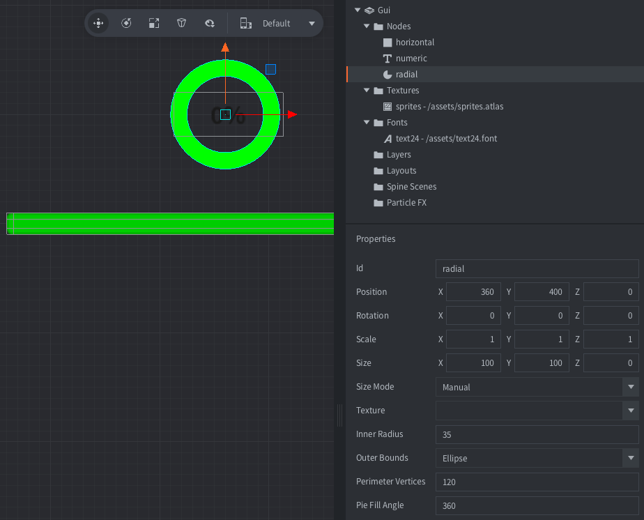

The example shows three different types of progress indicators:

1. A horizontal progress bar created using a box node with a texture and 9-slice scaling
2. A numerical progress text created using a text node
3. A circular progress created using a pie node

