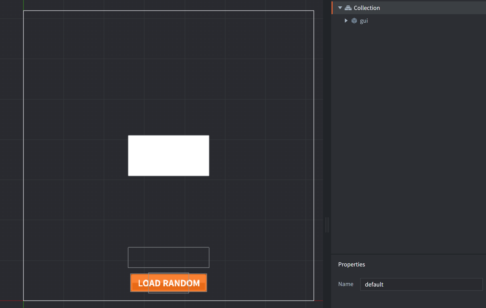
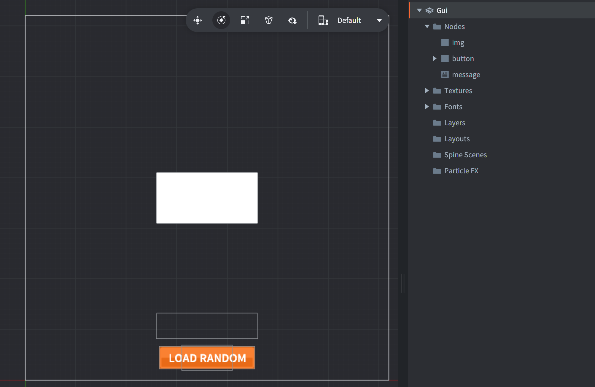

The "gui" game object contains a GUI component stored in the file *load_texture.gui*. The GUI contains
the setup with the "button" box node for the button image, the "text" text node for the button label text and the "img" box node for loaded images.

*load_texture.gui* has a script attached to it, called *load_texture.gui_script*, which contains the button logic and logic for loading images.

