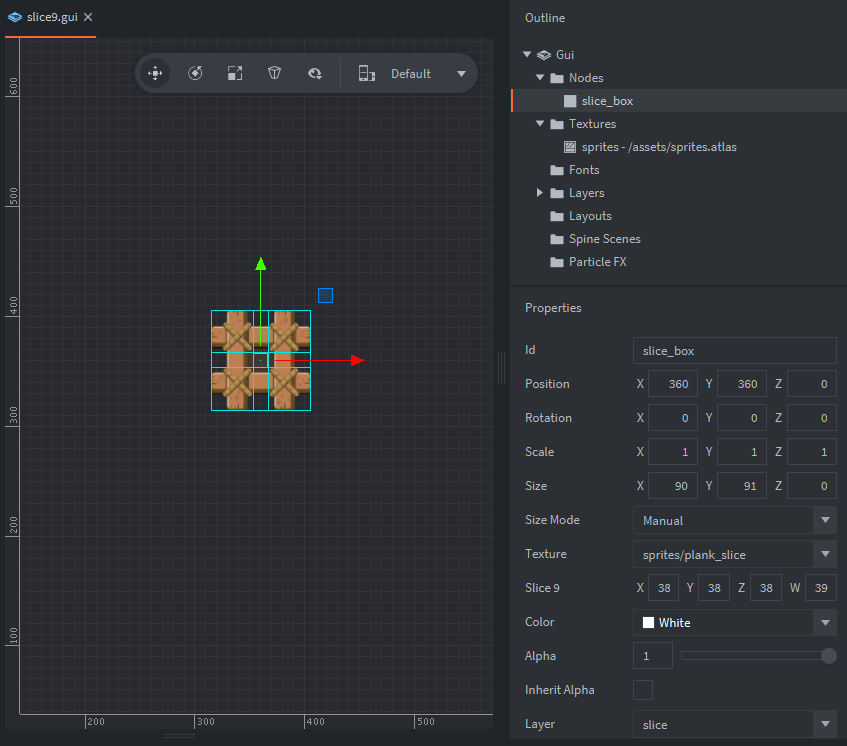

Overview : Using a small stylized image (90x91 pixels) we apply it to a gui node and set the slice-9 properties, we can then 
adjust the size and retain the styling without streching and distortion. [:More on Slice-9 with Defold:](https://defold.com/manuals/gui-box/#slice-9-texturing)

The setup consists of a gui collection, gui script, a box node and a texture atlas

Box Node
: contains:
  - A texture set to stylized wood plank image.
  - Size Mode set to Manual
  - Slice 9 adjusted settings
  
Gui script
: Use:
  - For animating the node to different sizes, showing slice-9 at its potential.  

