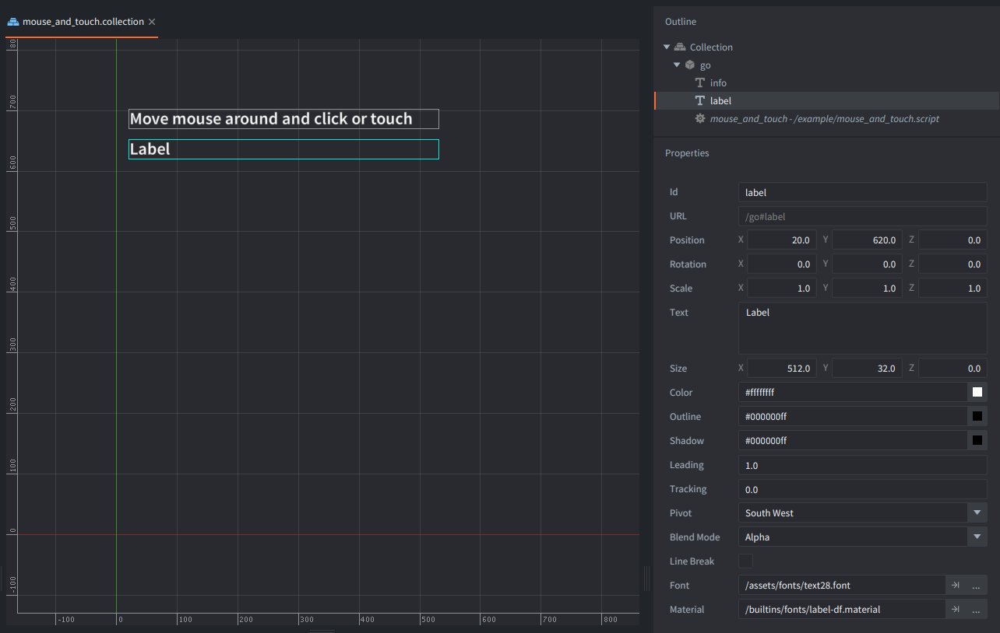
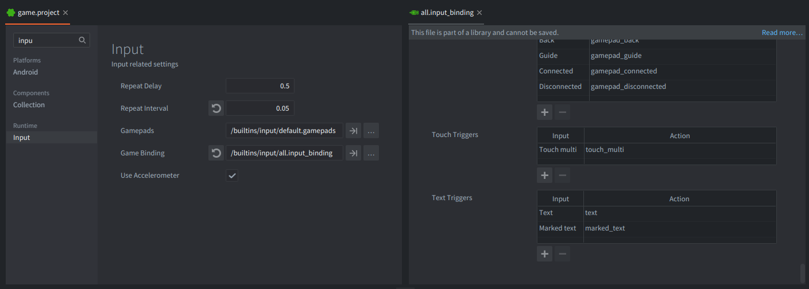

This example shows how to receive mouse and touch input in a script and display the current pointer position and button state.

Move the mouse or touch the window to update the label.
Press and release the left mouse button or touch the screen to see the state change.

## What You'll Learn

* How to acquire and release input focus
* How to read pointer coordinates from `action.x` and `action.y`
* How to handle the built-in `touch` action for mouse and touch input
* How to use `action.pressed` and `action.released`

## Setup

The collection contains one game object with `mouse_and_touch.script` and one label component. The script receives input and updates the label text with the current pointer position and state.

The project uses the built-in `/builtins/input/all.input_bindingc` input binding.
In that binding, the left mouse button and touch input are already mapped to the `touch` and `touch_multi` actions.
You can create and setup your own input bindings, and remember to adjust the action ids in the scripts accordingly.

## How It Works

The script asks for input focus in `init()`. After that, Defold calls `on_input()` when mouse or touch input is received.

Each input action contains the current pointer position in `action.x` and `action.y`. When the action id is `hash("touch")` or `hash("touch_multi")`, the script checks `action.pressed` and `action.released` to update a small state string.

The label text is written again with the pointer coordinates and the state to the local label component with `label.set_text()`.
