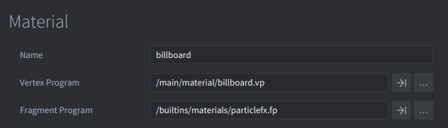
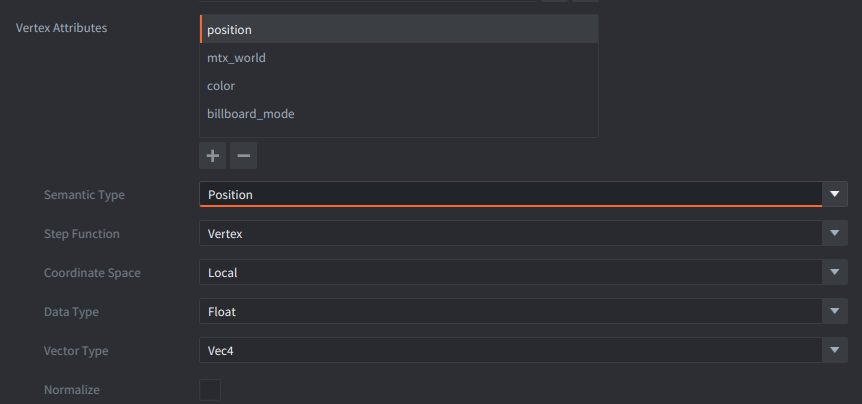
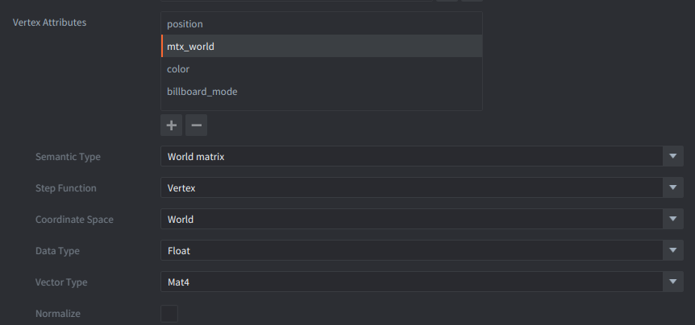
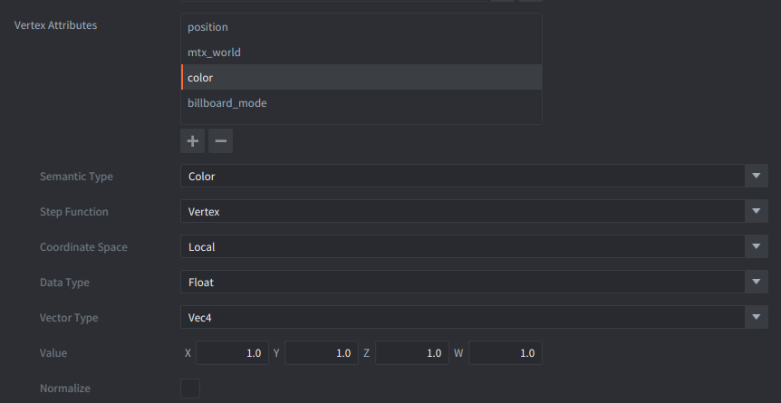
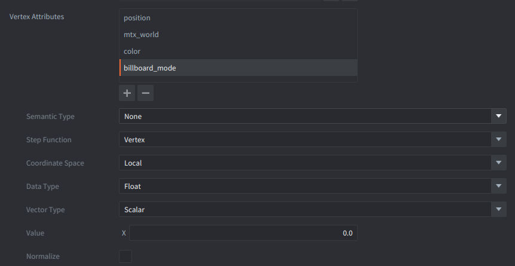
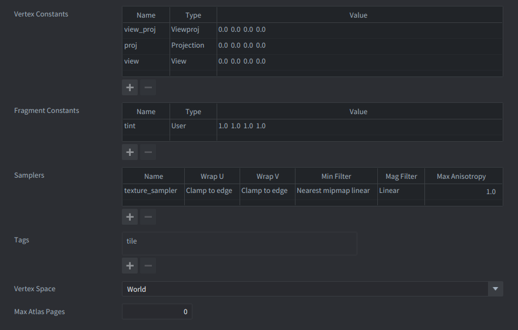
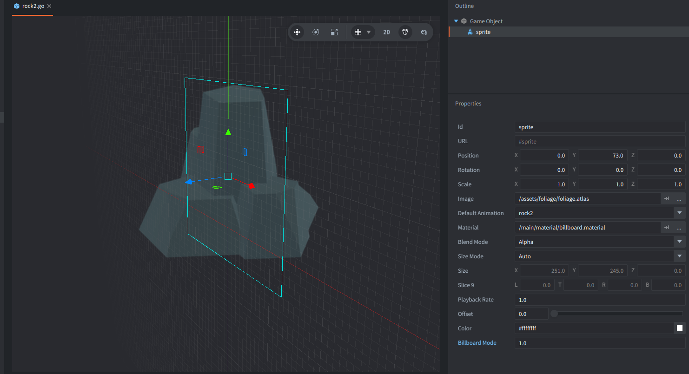
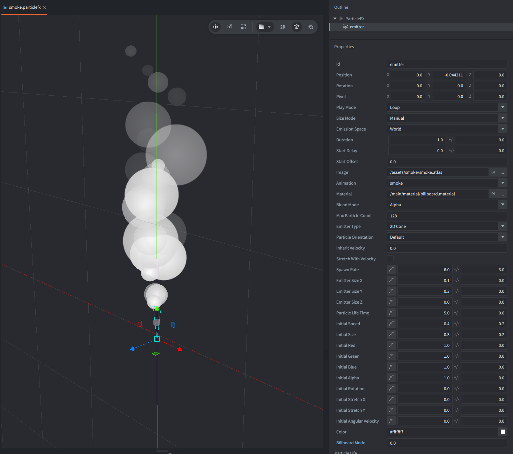

This example shows how to render **camera-facing quads (billboards)** in 3D using Defold materials. The core idea is to keep using Defold's built-in sprite/particle fragment shader, but replace the vertex shader so that each quad is re-oriented towards the camera.

The effect is used in two places:

- **Sprite components** for trees and rocks
- **ParticleFX emitters** for smoke

## Material setup

Create a custom material for billboarding (for example `main/material/billboard.material`) and set it up like this:

- **Vertex program:** `main/material/billboard.vp`
- **Fragment program:** `/builtins/materials/particlefx.fp`
  - This keeps standard particle/sprite sampling, tinting and alpha handling.

The material must provide these shader inputs:

- **Vertex attributes**

  | Name            | Semantic Type  | Vector Type | Description                                                    |
  |-----------------|----------------|-------------|----------------------------------------------------------------|
  | `position`      | Position       | Vector      | Local quad vertex position                                     |
  | `mtx_world`     | World matrix   | Mat4        | Quad center (translation) and scale; coordinate space: World   |
  | `color`         | Color          | Vector      | Forwarded to the fragment shader (for particlefx)              |
  | `billboard_mode`| None           | Scalar      | Selects the billboarding mode per instance/emitter             |

- **Vertex constants**

  | Name        | Type       | Description                                      |
  |-------------|------------|--------------------------------------------------|
  | `view_proj` | `ViewProj` | Transforms world position to clip space          |
  | `view`      | `View`     | Used to derive camera right/up vectors in world  |

## Sprite setup (foliage/rocks)

The foliage and rock game objects (for example `assets/foliage/tree1.go` and `assets/foliage/rock1.go`) each contain:

1. A **Sprite** component using the atlas `assets/foliage/foliage.atlas`
2. The material `main/material/billboard.material`
3. A per-sprite vertex attribute:
   - `billboard_mode = 1.0` (axis-locked billboard; see below)

This is enough to make each sprite face the camera without changing the sprite's transform in the game logic.

## ParticleFX setup (smoke)w

The smoke effect is defined in `main/smoke.particlefx`. The relevant settings are:

1. **Emitter material:** `main/material/billboard.material`
2. **Emitter attribute:** `billboard_mode = 0.0` (screen-aligned billboard; see below)
3. **Emission space:** `World`
   - This ensures particles exist in world space, while still being oriented towards the camera by the vertex shader.

## Billboard modes

The vertex shader supports two simple modes controlled by `billboard_mode`:

- `0.0` - **screen-aligned** billboard (faces the camera fully using the camera's right/up vectors)
- `1.0` - **axis-locked** billboard (rotates only around the world Y axis; useful for upright foliage)

You can set this value per Sprite instance or per ParticleFX emitter.

## Camera

This example uses the [Simple FPS Camera extension by Jhonny](https://github.com/Jhonnyg/defold-vantage) for camera control:
- Click Left Mouse Button and move to orbit the camera around the scene.
- Scroll to zoom in or out.

## Credits

Assets by:

- 3D buildings and props by Kay Lousberg: [KayKit - Medieval Hexagon](https://kaylousberg.itch.io/kaykit-medieval-hexagon)
- Trees and rocks - screenshots of 3D models by Kenney: [Fantasy Town Kit](https://kenney.nl/assets/fantasy-town-kit)
- Particlefx smoke texture - Defold Foundation - free to use - CC0
