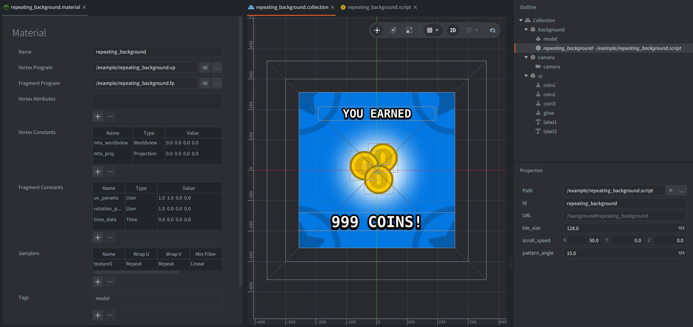

A repeating, scrolling texture is useful for reward screens, menu backgrounds, water, clouds, stars, and other effects where a small tile should fill a large area. This example uses a Model component with Defold's built-in `/builtins/assets/gltf/quad.gltf` mesh, a custom material, and a texture sampler set to repeat.

## What You'll Learn

- How to render a repeated texture on a full-screen glTF quad.
- How `WRAP_MODE_REPEAT` lets UV coordinates outside 0..1 tile the texture.
- How to pass repeat scale and scroll speed through a `CONSTANT_TYPE_USER` material constant.
- How to rotate repeated UV coordinates without rotating the full-screen quad.
- How to use `CONSTANT_TYPE_TIME` so Lua does not need to update the scroll offset every frame.

## Setup

The collection contains:

- `background` game object with a Model component
- `camera` with camera component (orthographic) that just frames the example view
- `ui` game object with example UI elements (coins, texts)

The `repeating_background` script exposes these properties:

- `tile_size`: the intended on-screen size of one texture tile, in pixels.
- `scroll_speed`: the scroll speed in pixels per second. Only the x and y components are used.
- `pattern_angle`: the angle, in degrees, used to rotate the repeated texture pattern in the shader.

The `background` game object itself is not rotated. Rotating the game object would rotate the screen-covering quad, so the visible result would be a rotated rectangle clipped by the viewport. To keep the background full-screen, leave the quad axis-aligned and rotate the UV coordinates in the fragment shader instead.

The model uses built-in `quad.gltf`, assigns `repeating_background.material`, and binds a `bg_icon.png` image to the material sampler named `texture0`.

The material has these important settings:

- **Vertex program:** `/example/repeating_background.vp`
- **Fragment program:** `/example/repeating_background.fp`
- **Sampler:** `texture0` with `Wrap U` and `Wrap V` set to `Repeat`
- **Fragment constant:** `uv_params` of type `User`
- **Fragment constant:** `rotation_params` of type `User`
- **Fragment constant:** `time_data` of type `Time`

`uv_params` is packed as follows:

- `uv_params.x`: how many tiles fit across the current window width.
- `uv_params.y`: how many tiles fit across the current window height.
- `uv_params.z`: horizontal scroll speed in UV tiles per second.
- `uv_params.w`: vertical scroll speed in UV tiles per second.

`rotation_params` stores `cos(angle)` and `sin(angle)` for the UV rotation. The shader uses these values to rotate the repeated texture coordinates inside the quad.

## How It Works

This example uses Defold's built-in glTF quad asset and `#version 140` shader syntax to use a modern rendering pipeline.

The scrolling offset is calculated with the passing time, received automatically from the built-in `Time` material constant, so the script does not need an `update()` callback just to animate the texture (available since Defold 1.12.3).

`repeating_background.script` reads the window size on startup, scales the one-unit glTF quad to cover the viewport, converts the window size to a repeat scale, and sends `uv_params` and `rotation_params` to the Model component. It also registers a window listener so the layout is recalculated only when the window is resized.

The shader does the continuous motion. The vertex shader only transforms the quad and forwards `texcoord0`. The fragment shader centers the UVs around the middle of the quad, scales them by `uv_params.xy`, rotates them with `rotation_params`, subtracts a time-based scroll offset, and samples `texture0` using repeated UV coordinates.

Because the scrolling offset is calculated from the engine-provided `Time` constant, no `update()` callback is needed just to animate the material. Lua only changes material data when the screen size or exposed properties determine a new repeat scale.

`pattern_angle` rotates the texture pattern and its local U/V axes. After the pattern is rotated, `scroll_speed.x` scrolls along the rotated U axis and `scroll_speed.y` scrolls along the rotated V axis. For example, keep `scroll_speed` at `(50, 0, 0)` and change `pattern_angle` to rotate a one-direction scrolling pattern; change both x and y in `scroll_speed` for diagonal movement in the pattern's local space.

## Related Example

This example and `sprite/texture_scrolling` both animate UV coordinates with the `Time` material constant, but they solve different problems.

- Use this example for a full-screen model background where a single texture should repeat freely outside the 0..1 UV range. The key material feature is `WRAP_MODE_REPEAT`.
- Use `sprite/texture_scrolling` for Sprite components, especially sprites using an atlas. The key material feature there is the `Texture Transform 2D` vertex attribute, which converts atlas UVs to local sprite UVs so scrolling stays inside the current atlas region.

## Credits

The asset used in this example is from Kenney's [Puzzle Pack 2](https://www.kenney.nl/assets/puzzle-pack-2), licensed under CC0.
