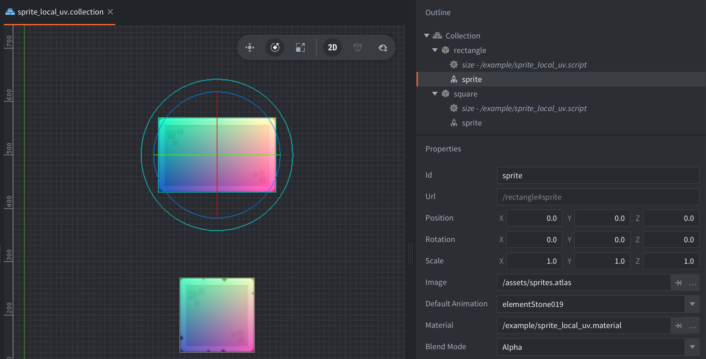
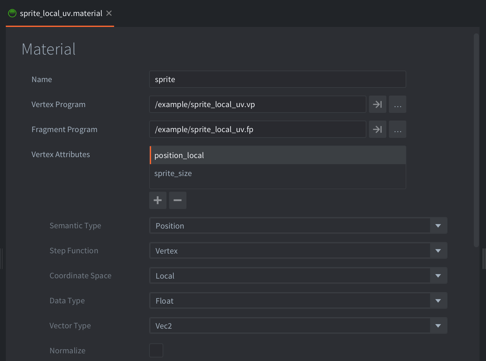

The example uses two game objects, each with a sprite component and a script.

The sprite component uses a custom sprite material `sprite_local_uv.material` with `local_position` and `sprite_size` as two vertex attributes. The `local_position` attribute is of semantic type "Position" and coordinate space "Local" while the `sprite_size` attribute is of semantic type "User" and will be set by the script.

The script gets the size of the sprite and sets it as the `sprite_size` vertex attribute.