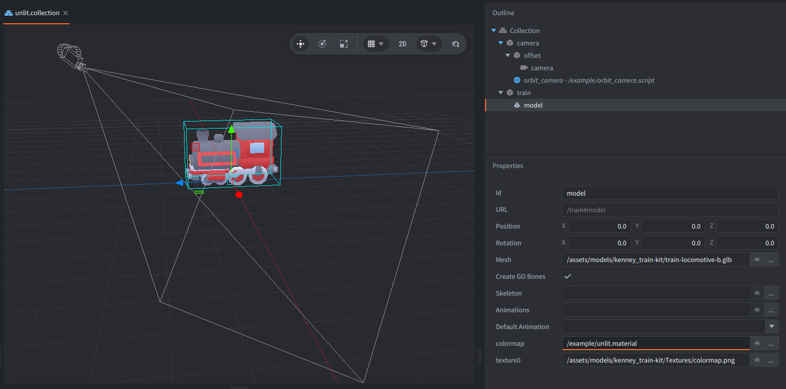
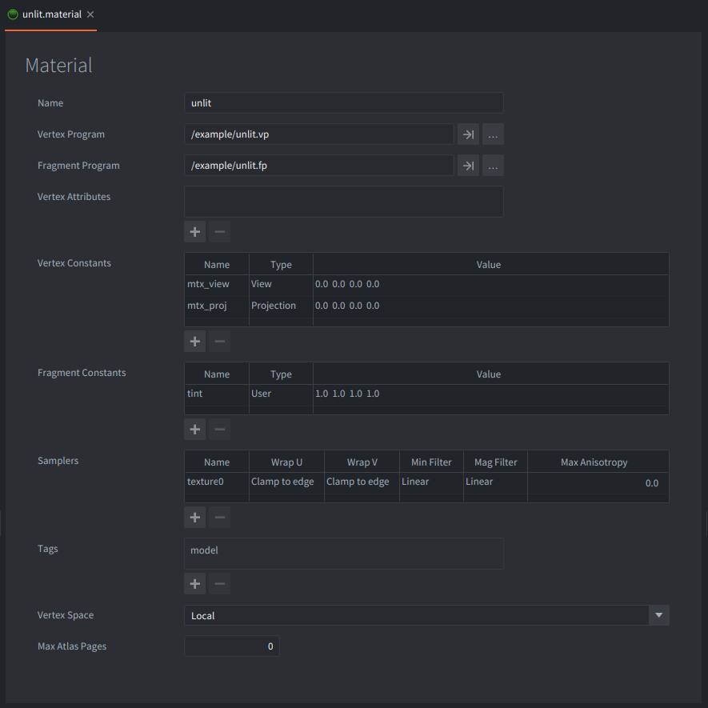

An unlit material renders a surface without any lighting calculation. It does not react to lights, normals, shadows, or specular highlights. The final color comes directly from the material inputs, usually a texture and a tint.

This is useful for stylized 3D, retro-looking models, previews, debug objects, lamps, signs, and examples where the model should keep the same texture colors regardless of scene lighting.

## What You'll Learn

- How a Model component uses a custom material
- Which constants and samplers an unlit model material needs
- How a vertex shader transforms model vertices to the screen
- How a fragment shader samples a texture without lighting

## Setup

The collection contains two game objects: `train` and `camera`.

<kbd>train</kbd>
: Contains a Model component using `/assets/models/kenney_train-kit/train-locomotive-b.glb`. The model's `colormap` material slot uses `/example/unlit.material`, and its `texture0` sampler uses the train kit `colormap.png` texture.

<kbd>camera</kbd>
: Contains a perspective Camera component and `orbit_camera.script`. Drag or touch to orbit the camera around the model, and use the mouse wheel to zoom.



## Material

`unlit.material` connects the model to two shader programs:

- `unlit.vp` for vertex transformation
- `unlit.fp` for fragment color output

The material uses `Vertex Space: Local`, so the vertex shader receives model vertices in local space. It also declares the `mtx_view` and `mtx_proj` vertex constants, which Defold fills from the active camera, and the `texture0` sampler used by the fragment shader.

The material also declares a user fragment constant named `tint`. The fragment shader multiplies the sampled texture color by this tint, which keeps the material compatible with the standard model tint workflow.



## How It Works

The vertex shader receives each vertex position, its texture coordinates, and the model's world matrix. It passes the texture coordinates to the fragment shader, then transforms the local vertex position with:

```glsl
mtx_proj * mtx_view * mtx_world * vec4(position.xyz, 1.0)
```

That moves the vertex from model space to world space, then through the camera view and projection matrices into clip space.

The fragment shader receives the interpolated texture coordinates, samples `texture0`, applies the premultiplied `tint`, and writes the result to `final_color`. There are no light directions, normal calculations, shadow maps, or specular terms. The texture color is the final surface color.

This is why unlit models look flat and evenly colored compared with Defold's built-in lit model material. The surface still has perspective and texture detail, but its brightness does not change when the model rotates or when lights are added to the scene.

## Credits

The model used in this example is from Kenney's [Train Pack](https://kenney.nl/assets/train-kit), licensed under CC0.
