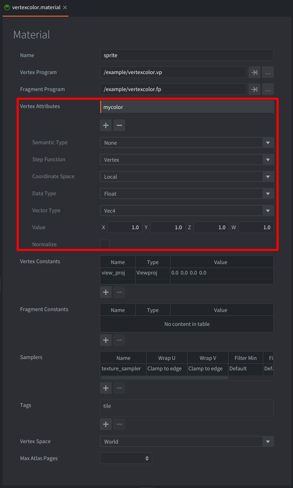

The `vertexcolor.script` sets the vertex attribute "mycolor", which has been specified in the material.

The shaders specified by the material also makes use of the `mycolor` attribute to colorize the sprites.

The vertex attributes can also be animated. Click the image for an animation effect.
