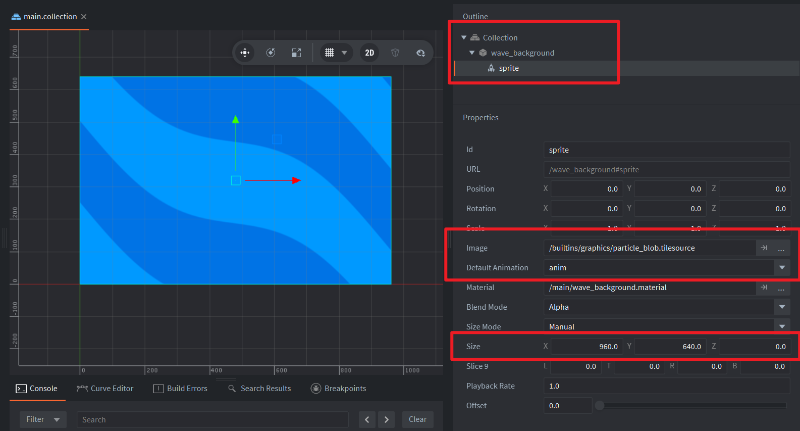

This example contains a game object with a sprite component. The Image and Default Animation properties of the sprite component cannot be left empty, otherwise an error will occur. I suggest directly using the built-in /builtins/graphics/particle_blob.tilesource and anim. You can adjust the size of the wave background by modifying the Size property of the sprite component.

Related Defold forum post: https://forum.defold.com/t/open-source-defold-1-12-3-constant-type-time-example/82625

