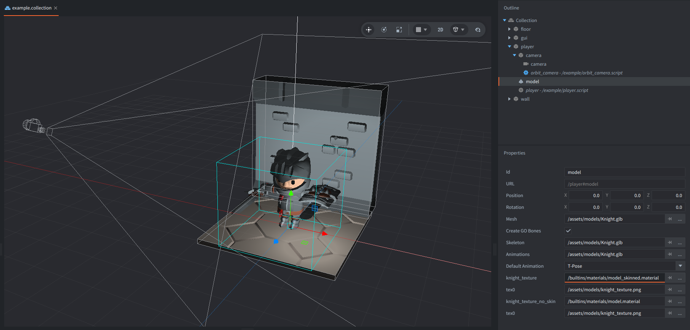

This example uses a skinned glTF character with multiple animations and a simple orbit camera. The model contains both mesh and animation data, so the example can switch animations and visible mesh parts without loading any extra assets.

## What You'll Learn

- How to play named skeletal animations from a glTF model
- How to toggle mesh parts on a skinned model to change the visible equipment
- How to use Defold's built-in skinned model material for animated meshes
- How to orbit a camera around a 3D character
- How to trigger animations from GUI buttons

## Setup

The collection contains five game objects: `floor`, `wall`, `player`, `camera`, and `gui`.

<kbd>floor</kbd>
: Contains a Model component using `floor_tile_large.gltf.glb` with the dungeon texture. It forms the ground plane of the scene.

<kbd>wall</kbd>
: Contains a Model component using `wall.gltf.glb` with the same dungeon texture. It closes off the back of the room.

<kbd>player</kbd>
: Contains `player.script` and a skinned Model component using `Knight.glb` and `knight_texture.png`. The animated `knight_texture` material slot uses `/builtins/materials/model_skinned.material`, which supports the skeleton skinning used by the character mesh. The glTF file includes the character meshes, skeleton, and animation clips.

<kbd>camera</kbd>
: Contains a Camera component and `orbit_camera.script`. Drag or touch to orbit around the character, and use the mouse wheel to zoom. The script exposes `zoom`, `min_zoom`, `max_zoom`, `zoom_speed`, `rotation_speed`, and `offset` as properties so the camera can be tuned from the collection.

<kbd>gui</kbd>
: Contains `example.gui` and `example.gui_script`. The GUI shows a short instruction label plus five buttons labeled `1` to `5`. Clicking or tapping them sends animation messages to the player.

## How It Works

`player.script` starts the model in `Idle`, then enables the mesh parts that define the chosen loadout. Pressing keys `1` to `5`, or clicking the GUI buttons, calls `model.play_anim()` with different animation names stored in the glTF file.

`example.gui_script` uses `gui.pick_node()` to detect which button was clicked or tapped. It sends the chosen animation name to the player with `msg.post()`, so the GUI stays decoupled from the model logic.

The orbit camera script keeps the character centered while the player drags, touches, or scrolls. Zoom changes are clamped between the `min_zoom` and `max_zoom` properties, making it easy to inspect the animation from different angles without moving the character itself.

The model and assets are [made by Kay Lousberg](https://kaylousberg.com/game-assets/).
