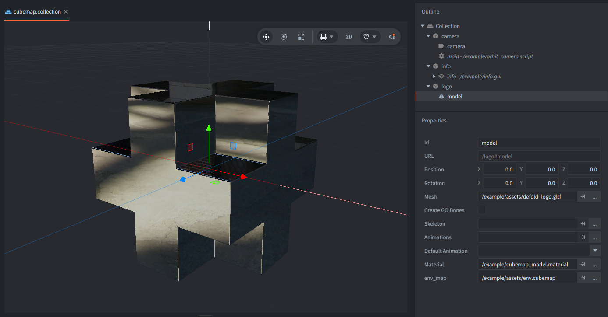

The example renders the Defold logo with a custom material that reflects an environment cubemap. Drag or touch to orbit around the model and use the mouse wheel to zoom.

## What You'll Learn

- How to bind a cubemap texture to a model material sampler
- How to compute world-space reflection vectors for environment mapping

## Setup

The collection contains a `logo` game object with an embedded Model component using `/example/assets/defold_logo.gltf`. Its material is `/example/cubemap_model.material`, and the material's `env_map` sampler is bound to `/example/assets/env.cubemap`.

The `camera` game object contains a perspective Camera component and `orbit_camera.script`. The script is used only to move the camera around the logo from pointer and mouse wheel input.

There is also an `info` game object with a GUI with a text to display controls on screen.

## How It Works

`cubemap_model.vp` receives the model position, normal, and per-instance `mtx_world` attribute. It transforms the normal into world space, derives the camera world position from the view matrix, and calculates a reflection vector for each vertex.

`cubemap_model.fp` samples the cubemap with that reflection vector. A small Fresnel term makes the logo edges more reflective, which makes the environment reflection easier to see while keeping the shader focused on cubemap sampling.
