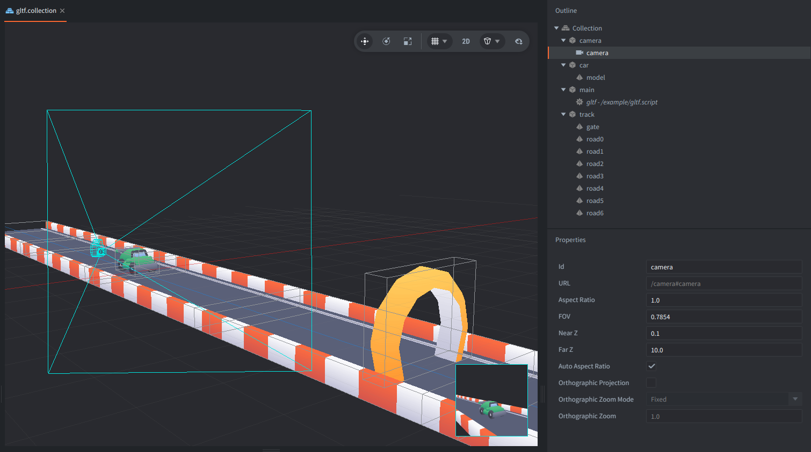

This example uses three glTF model assets from Kenney's Toy Car Kit to build a small endless road scene. The car stays in place while the road segments move forward and loop behind it.

## What You'll Learn

- How to place multiple glTF model components in one collection
- How to loop repeated road segments to fake an infinite track

## Setup

The collection contains three game objects: `car`, `camera`, and `track`.

`car` uses `vehicle-racer.glb` with the unlit material and the shared `colormap.png` texture.

`camera` is a perspective camera positioned so the car and road stay in view.

`track` contains six copies of `track-road-wide-straight.glb` and a `gate.glb` model. `gltf.script` moves the whole game object along the Z axis and wraps it back to the start once the last road section passes the camera.

The models use an unlit material so the texture colors stay clear and even without setting up lights. For the material and shaders details, see the [Unlit material example](https://defold.com/examples/material/unlit/).

## How It Works

The script keeps a single Z position in `self.current_z`. Every frame it advances that value by `self.speed * dt`, then applies it to the `track` game object.

Once the track reaches the loop point, the script subtracts the loop length and starts again. That creates the illusion of a long road without needing to spawn or destroy any models.

## Credits

The models used in this example are from Kenney's [Toy Car Kit](https://kenney.nl/assets/toy-car-kit), licensed under CC0.
