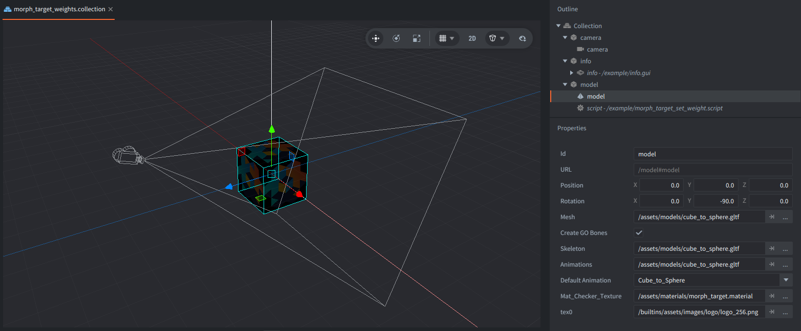
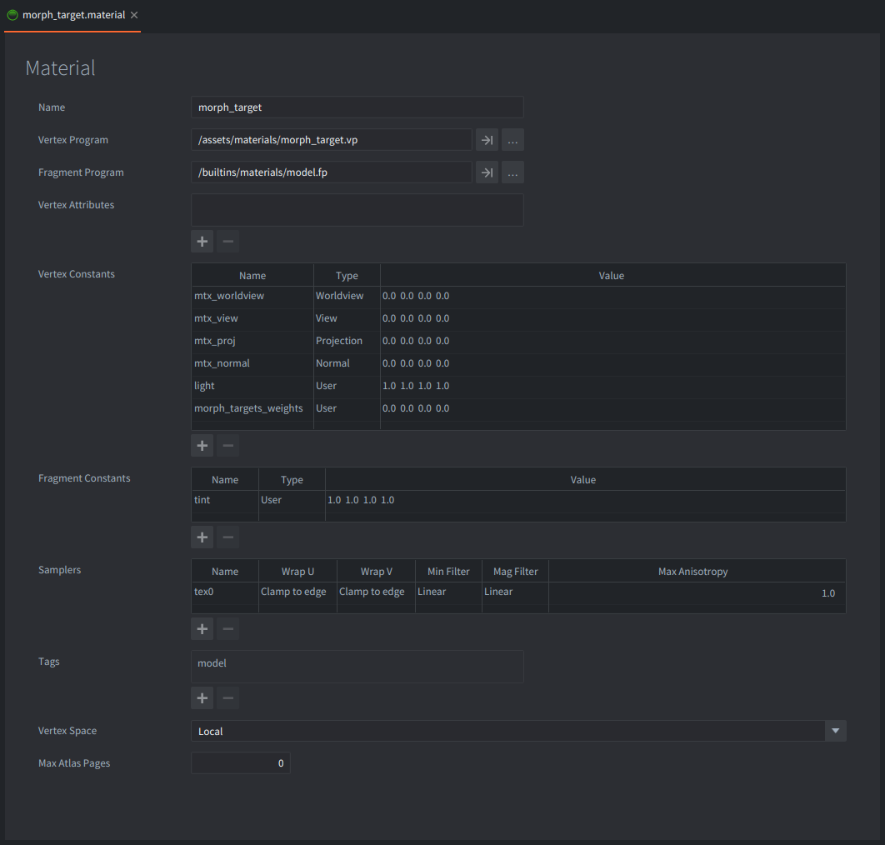

This example lets you move the pointer left and right to blend a glTF model from a cube into a sphere. The morph target weight is controlled from Lua with `model.set_blend_weights()` instead of being driven by the model's built-in animation.

## What You'll Learn

- How to load a glTF file that contains morph targets in a Model component
- How to stop model animation with `model.cancel()`
- How to set morph target weights manually with `model.set_blend_weights()`
- How to create a model material to apply morph target data

## Setup

The collection contains a model game object, a camera, and an info GUI.

<kbd>model</kbd>
: Contains a Model component and `morph_target_set_weight.script`. The Model component uses `/assets/models/cube_to_sphere.gltf` for its mesh, skeleton, and animation data. The glTF file has one morph target and a `Cube_to_Sphere` animation, but the script cancels the animation so input can control the weight directly.

<kbd>camera</kbd>
: Contains a perspective Camera component positioned above and in front of the model.

<kbd>info</kbd>
: Contains a GUI with the on-screen instruction text near the bottom of the screen.



The Model component uses `/assets/materials/morph_target.material`. This material declares the `morph_targets_weights` vertex constant and uses a vertex shader that samples the generated `morph_targets` texture array. Without those bindings, Lua can change the weights but the material will not render the deformed mesh.



## How It Works

`morph_target_set_weight.script` acquires input focus, cancels the model's default animation, and initializes the morph weight to `0.0`. A weight of `0.0` shows the base cube, while a weight of `1.0` applies the sphere morph target fully.

When the pointer moves, the script divides `action.screen_x` by the window width to get a normalized value from left to right. It stores that value in the first entry of a weights table and calls:

```lua
model.set_blend_weights("#model", { weight })
```

The table values match the morph target order in the glTF file. This model has one target, so the table contains one value. A model with several targets would pass several numbers, for example `{ smile_weight, blink_weight, jaw_weight }`. Extra values are ignored, and missing values are treated as zero for remaining targets.

`model.set_blend_weights()` overrides the weights that would otherwise come from animation. The override is applied every frame after animations run. Calling `model.set_blend_weights("#model")` with no table, or passing `nil` as the second argument, clears the override and lets model animations drive the morph target weights again.

## Credits

The `cube_to_sphere.gltf` asset is CC0 / Public Domain Dedication created by the Defold Foundation.
