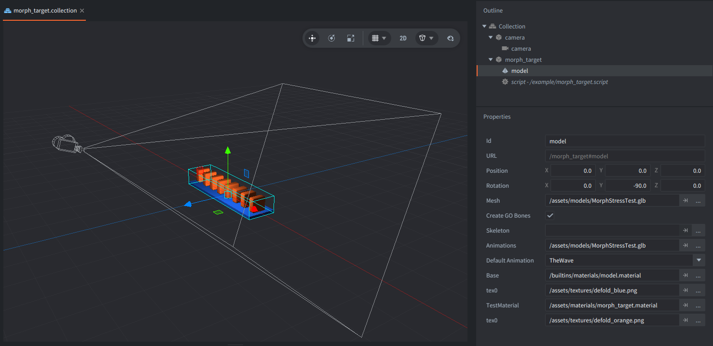

This example plays a glTF animation that changes morph target weights over time. The model uses a custom material so the vertex shader can apply the weighted morph target offsets while the animation plays.

## What You'll Learn

- How to reference a glTF file with morph targets in a Model component
- How to play a named model animation with `model.play_anim()`
- How a custom model material can read morph target data in the vertex shader

## Setup

The collection contains one camera and one `morph_target` game object.

<kbd>morph_target</kbd>
: Contains a Model component and `morph_target.script`. The Model component uses `MorphStressTest.glb` for both mesh and animation data. The glTF file includes the animations `Individuals`, `TheWave`, and `Pulse`; this example plays `TheWave`.

<kbd>camera</kbd>
: Contains a perspective Camera component positioned above and in front of the model.

The model has two material slots. `Base` uses the built-in model material, while `TestMaterial` uses `morph_target.material` and the `morph_target.vp` vertex shader that applies the morph target deltas.

## How It Works

`morph_target.script` starts the `TheWave` animation in a loop, and you can cycle through other animations for the model by clicking or touching anywhere. The glTF animation changes the model's morph target weights, and Defold makes those weights available to the custom material through the `morph_targets_weights` shader constant.

The vertex shader samples the `morph_targets` texture array, combines the active target offsets, and adds the result to each vertex position before the model is transformed by the camera matrices.

## Credits

The `MorphStressTest.glb` asset is CC-BY 4.0, Copyright 2021 Analytical Graphics, Inc. Model by Ed Mackey.
[https://github.com/KhronosGroup/glTF-Sample-Assets/tree/main/Models/MorphStressTest](https://github.com/KhronosGroup/glTF-Sample-Assets/tree/main/Models/MorphStressTest)
