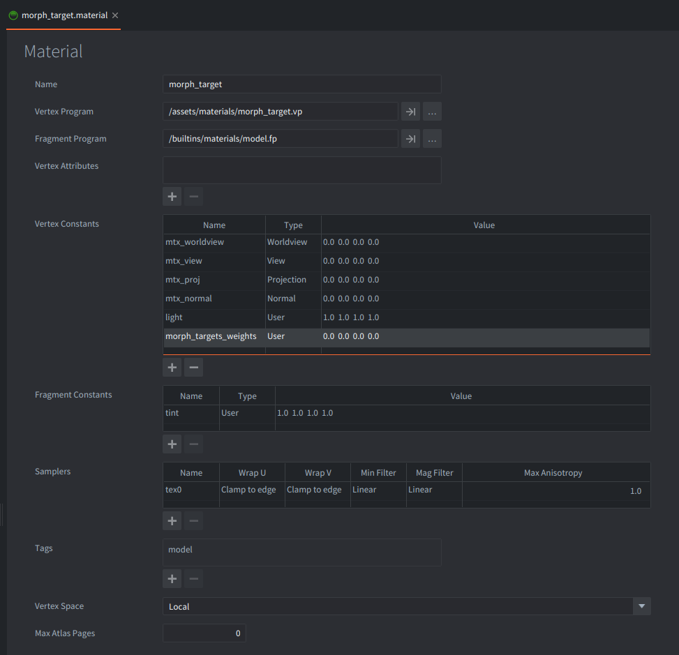

This example plays morph target animations from a glTF model. The model uses a small custom material based on Defold's built-in model material, with the extra shader bindings needed to render morph target deformation.

## What You'll Learn

- How to use a glTF file that contains morph targets and weight animations
- How to play a named model animation with `model.play_anim()`
- How to cycle between several morph target animations with input
- How to create a model material to apply morph target data

## Setup

The collection contains one camera and one `morph_target` game object.

<kbd>morph_target</kbd>
: Contains a Model component, `morph_target.script`, and `info.gui`. The Model component uses `/assets/models/MorphStressTest.glb` for mesh, skeleton, and animation data. The glTF file contains eight morph targets and three animations: `TheWave`, `Pulse`, and `Individuals`.

<kbd>camera</kbd>
: Contains a perspective Camera component positioned above and in front of the model.

<kbd>info</kbd>
: Contains a GUI component with instructions for the example.


The glTF model has two material slots, `Base` and `TestMaterial`. Both slots use `/assets/materials/morph_target.material`; the blue and orange textures only make the two parts of the model easier to distinguish. Custom material has vertex constants `morph_targets_weights` of type `User` for applying weighted morph targets.



## How It Works

`morph_target.script` stores the animation names in a small table. In `init()`, it acquires input focus and starts `TheWave` with:

```lua
model.play_anim("#model", "TheWave", go.PLAYBACK_LOOP_FORWARD)
```

The animations in the glTF file target the model's morph weights. As the animation plays, Defold updates the material constant named `morph_targets_weights` and binds the model's morph target texture to the material sampler named `morph_targets`.

The stock model material is useful as a starting point, but it does not apply morph target deltas by itself. This example therefore uses `/assets/materials/morph_target.material`, which declares the expected morph target bindings and uses `/assets/materials/morph_target.vp` to sample the morph target texture. The vertex shader reads the active weights, samples the position delta for each target, and adds the weighted result to the base vertex position before projection.

When you click or touch the screen, `on_input()` advances to the next animation name and calls `model.play_anim()` again. The example loops through `TheWave`, `Pulse`, and `Individuals`.

## Credits

The `MorphStressTest.glb` asset is CC-BY 4.0, Copyright 2021 Analytical Graphics, Inc. Model by Ed Mackey.
[https://github.com/KhronosGroup/glTF-Sample-Assets/tree/main/Models/MorphStressTest](https://github.com/KhronosGroup/glTF-Sample-Assets/tree/main/Models/MorphStressTest)
