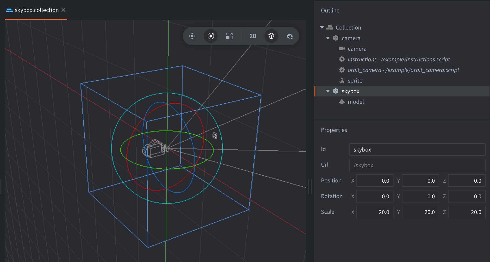

This example shows how to create a skybox. A skybox is a technique that makes the scene look bigger and more impressive by wrapping the viewer with a texture that goes around the camera 360 degrees.

An in-depth explanation of skybox rendering can be found in [Tutorial 25 of OGL Dev](https://www.ogldev.org/www/tutorial25/tutorial25.html).

One of the key components of a skybox is the cubemap texture. A cubemap is a texture that contains 6 individual 2D textures that each form one side of a cube: a textured cube.

The cubemap is projected on a sphere or a cube positioned in such a way that the camera and other objects are placed inside the cubemap:

Skybox texture by Jockum Skoglund aka hipshot. Free to use.