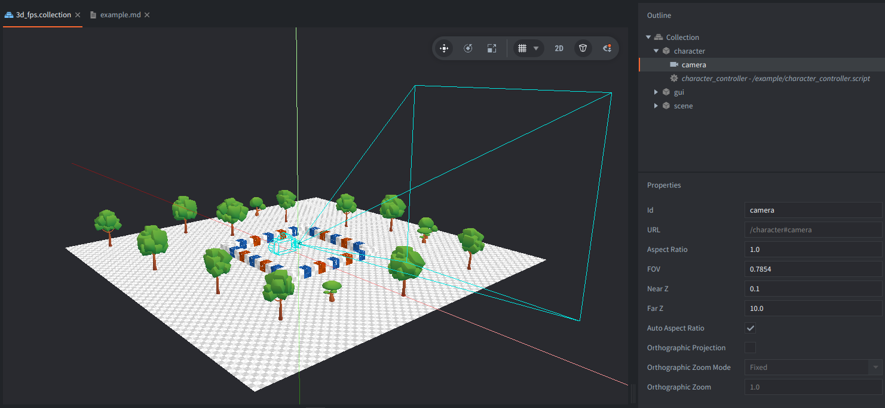

This example shows how to build a simple first-person controller for a 3D scene. You can look around with the mouse and move on the XZ plane using the keyboard (WSAD).

## What you'll learn?
- How to implement a FPP camera with mouse to look around.
- How to lock/unlock the mouse cursor for immersive camera control.
- How to move on a simple XZ plane logic with keyboard input.

## Controls
| Input                  | Action                                               |
|------------------------|------------------------------------------------------|
| Left mouse click       | Lock the cursor and enable mouse look                |
| Mouse movement         | Rotate camera                                        |
| `Esc`                  | Unlock the cursor                                    |
| `W`/`S`/`A`/`D`        | Move forward/backward/left/right on the ground plane |

## How it works?
When the cursor is locked, the script reads mouse movement deltas and rotates the camera accordingly. Movement is normalized to keep a consistent speed in all directions and is clamped within a square area so you cannot wander off the demo scene.

Example collection consists of 3 main parts:

- `character` - The player character game object includes:
  - A *script* `character_controller.script` component that implements mouse look, cursor lock/unlock, and WASD movement.
  - A *camera* component configured with perspective projection.

- `scene` - the models used to create a basic 3D environment:
  - Ground plane scaled to form a walkable area with prototype texture
  - Walls built from simple cube models with prototype textures
  - Some decorative trees

- `gui` - An on-screen GUI with short instructions.

### Assets
Tree models with textures by Kay Louseberg: https://kaylousberg.itch.io/kaykit-forest
Prototype textures for Defold by Visionaire: https://github.com/Thevisionaire1/3Deforms

## Script

Tuning parameters are defined at the top of `character_controller.script`:
- `look_sensitivity` (degrees per pixel) controls how fast the camera rotates
- `move_speed` (world units per second) controls walking speed
- `move_limit` (half-size in world units) clamps movement within bounds

