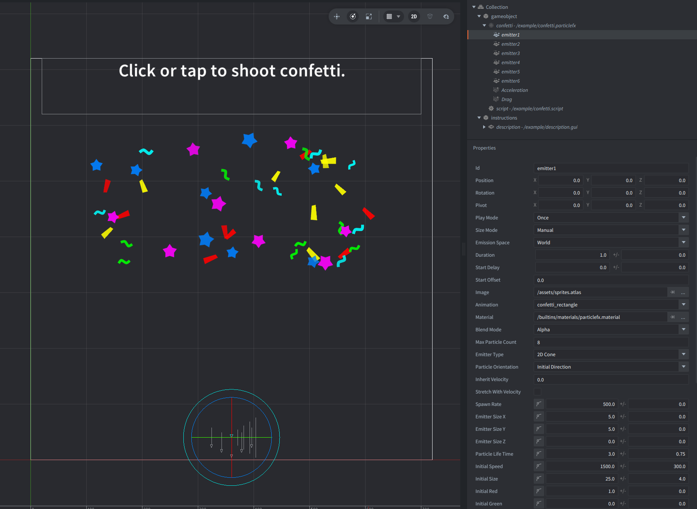

In this example we create a confetti fireworks effect. It is usually used on final screens to congratulate the player on successful completion of a level or game.

## Setup

The particlefx consists of 6 emitters. They are all the same, but with different images and RGB colors.

It has two modifiers:
 - Acceleration to make the particles fly downwards, i.e. to simulate gravity.
 - Drag to slow down the initial speed of the particles.

Changed properties (from default):
 - Blend Mode: Alpha for transparency blending
 - Max Particle Count: 8 to limit number of particles
 - Emitter Type: 2D Cone to set initial direction of the particles
 - Spawn Rate: 500 to spawn all particles at once
 - Emitter Size X: 100 +/- 20
 - Initial Speed: 1500 +/- 300 to make particles fly upwards
 
In addition, the curves for Life Scale, Life Alpha, Life Rotation properties have been adjusted to make the particles look like real confetti.

The collection consists of the game object with the particle FX and script, and additional GUI to show instructions.

## How It Works

The main script `confetti.script` spawns the particlefx on startup once, and each time when mouse button is clicked or screen touched.

It also has a timer that spawns the particlefx in a loop with a 3 second delay.
