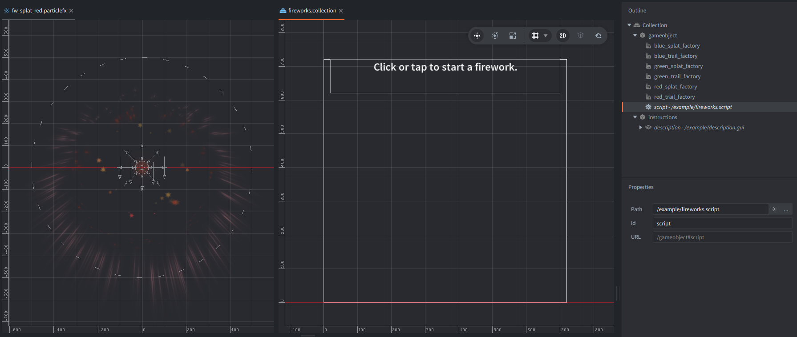

## Setup

The collection contains:

- one controller game object with `fireworks.script`;
- six embedded factories: one `trail` factory and one `splat` factory for each of the three colors;
- one GUI component that shows the click/tap instruction on screen.

Each firework is built from two separate particlefx game objects:

- a looping `trail` effect that represents the rocket while it is flying;
- a one-shot `splat` effect that represents the explosion at the end.

The script does not use `update()`. It spawns the trail object, animates it with `go.animate()`, and starts the burst effect from the animation callback when the flight finishes.

## Trail particlefx

The `trail` particlefx is a looping effect made from two cone emitters using the `fw_trace_02` sprite:

- one main colored streak;
- one smaller additive glow layered on top of it.

Both emitters use `EMISSION_SPACE_WORLD`, so emitted particles stay behind in world space instead of following the moving game object. That creates the visible rocket trail while the rocket object itself is animated separately.

The trail game object itself is prepared by the script before the animation starts:

- position is set near the bottom of the screen;
- rotation is set to the initial launch direction;
- scale is animated down over time so the trail feels like it is burning out before the explosion.

## Burst particlefx

The `splat` particlefx is a one-shot layered effect. In the red variant it uses several circle emitters with different sprites and blend modes:

- stretched streak particles using `fw_trace_01`;
- star particles using `fw_star_01`;
- an additive streak layer for extra brightness;
- a circular flash using `fw_circle_01`;
- two soft light flashes using `fw_light_01`, including an additive glow.

Some of these emitters use acceleration and radial modifiers. Those modifiers push particles outward, shape the burst, and add a little variation to the explosion instead of letting every particle travel in a perfectly uniform way.

Like the trail, the burst emitters also use `EMISSION_SPACE_WORLD`, so the explosion stays fixed at the burst position after it has been spawned.

## Script and spawning

The script handles spawning in three ways:

- it launches one firework in `init()`;
- it starts a repeating timer that launches another firework every 3 seconds;
- it launches another firework when the left mouse button is pressed, which also works as click/tap input in the example.

To keep the effect under control, the script allows at most 6 active fireworks at the same time.

`spawn_firework()` first checks that limit. It then:

- picks a random color from `red`, `green` and `blue`;
- creates the matching trail and burst game objects with `factory.create()`;
- generates a random launch angle, launch strength and flight time;
- computes the initial position near the bottom of the screen, a launch direction, and a target end position;
- starts the trail particlefx;
- starts `go.animate()` for `position.x`, `position.y` and `scale`.

The rocket flight uses two separate property animations:

- `position.x` uses linear easing;
- `position.y` uses `go.EASING_OUTQUAD`;
- `scale` is animated down during the flight.

Using different easing for X and Y gives a simple curved flight path without a manual simulation loop. When the Y animation finishes, its completion callback stops and deletes the trail object, reads its final position, and plays the burst effect there. A separate one-shot timer then deletes the burst object after a short cleanup delay.

To reuse this setup in another project:

- add factories for the trail and burst particlefx game objects;
- spawn both objects with `factory.create()`;
- choose a start position, a target position and a flight time;
- animate the trail object with `go.animate()`;
- trigger and clean up the burst effect from the animation callback.

Particle sprites are CC0 from Kenney Particle Pack.
