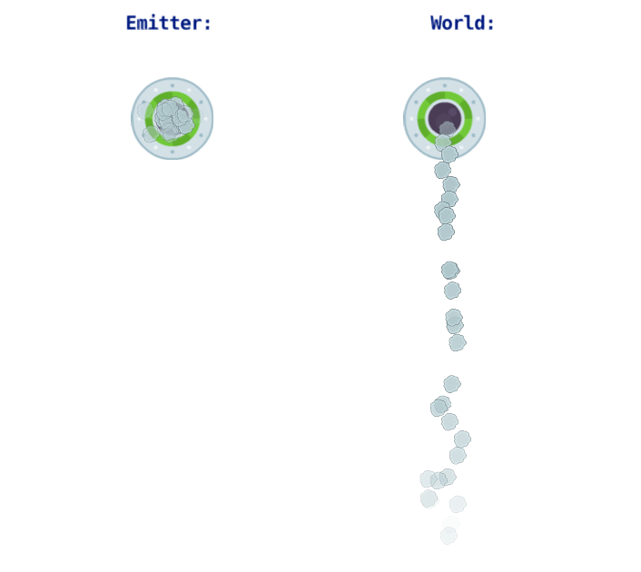

This example shows how particle emission space affects particle behavior when the emitter object moves. The setup consists of two UFO objects with identical particle effects, but different emission space settings.

The example collection consists of 2 game objects that differ only in the particlefx used:

- particlefx on the left has Emission Space property set to "Emitter":

- particlefx on the right has Emission Space property set to "World":

Both game objects are animated up and down, so that you can see the difference between the emission space:

Particles emitted in emitter space are "moving" with the object, so their position is always respective to the emitter actual origin.

Particles emitted in world space have positions respective to the world coordinates.

Use this example to understand when to use local vs world emission space in your particle effects!

