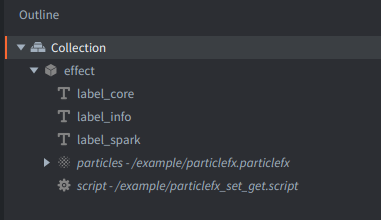
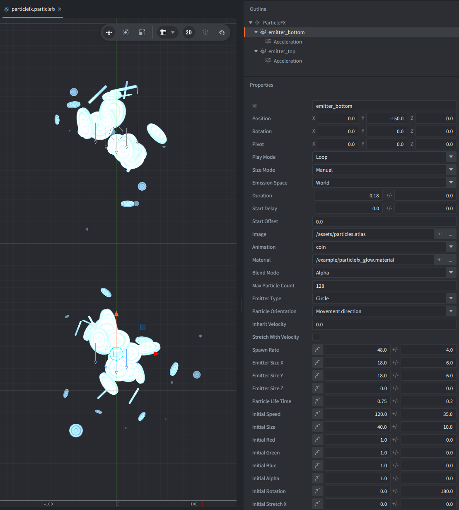

Since Defold 1.12.2 you can use `go.get()` and `go.set()` on individual ParticleFX emitters by passing `keys = { "..." }`.

This example focuses on this feature. It toggles a ParticleFX between two setups and shows the properties of the active emitters in the labels.

## Setup

1. Example consists of one game object in the collection having:

   - script `particlefx_set_get.script`
   - ParticleFX component named `#particles`
   - 2 label components: `#label_core` and `#label_spark`
   

2. The ParticleFX:

   - has two emitters: `emitter_top` and `emitter_bottom`
   

3. The script has the resources exposed as properties:

   - `particles_atlas`
   - `sprites_atlas`
   - `default_material`
   - `glow_material`

   The current script switches the emitter `image` directly from code and keeps `default_material` active for the shown setup.

4. The example uses 2 atlases with given animations:

   - the `particles.atlas` with `coin` and `smoke` animations
   - the `sprites.atlas` with `ship_red` and `ship_dark` animations

The atlases are set up to contain the animation ids used by the script, so the example can switch between the two setups without extra transition logic. It would also be possible to read the animations from `resource.get_atlas()`, but this example keeps a small hardcoded `ANIMATIONS` table to stay as simple as possible.

## How it works

The script keeps two hardcoded setups and toggles between them whenever you click or tap:

1. `particles.atlas` + default particle material
   `emitter_top` uses `coin`
   `emitter_bottom` uses `smoke`
2. `sprites.atlas` + default particle material
   `emitter_top` uses `ship_red`
   `emitter_bottom` uses `ship_dark`

On startup the script stores the current atlas name, reads back the authored emitter properties, writes them into the labels, and starts the ParticleFX. When the setup changes after that, the script:

1. stops the ParticleFX with `{ clear = true }`
2. flips `self.atlas_name` between `sprites_atlas` and `particles_atlas`
3. looks up the atlas resource and the correct animation pair from the `ANIMATIONS` table
4. calls `set_emitter_properties()` for each emitter to set `image`, `animation`, and `material`
5. calls `get_and_print_emitter_properties()` to read the current values back with `go.get()`
6. writes them into the two labels
7. plays the ParticleFX again

The helper function `set_emitter_properties()` applies properties per emitter by passing the emitter id in `keys`:

```lua
go.set("#particles", "image", image, { keys = { "emitter_top" } })
go.set("#particles", "animation", animation, { keys = { "emitter_top" } })
go.set("#particles", "material", material, { keys = { "emitter_top" } })
```

The helper function `get_and_print_emitter_properties()` uses the same `keys` pattern with `go.get()` and writes the result into the labels, so the example shows which values are currently active for each emitter.

One important limitation: **emitter property changes only affect the next play**. The script therefore stops the ParticleFX, clears any already spawned particles, applies the new emitter overrides, and then plays it again.
