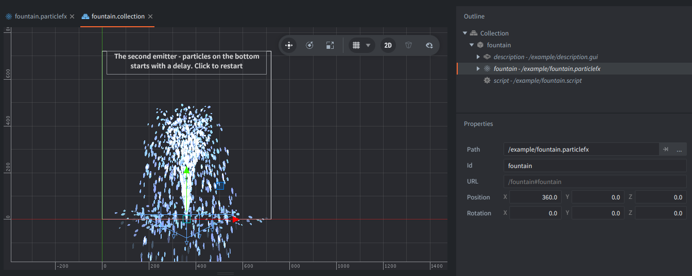
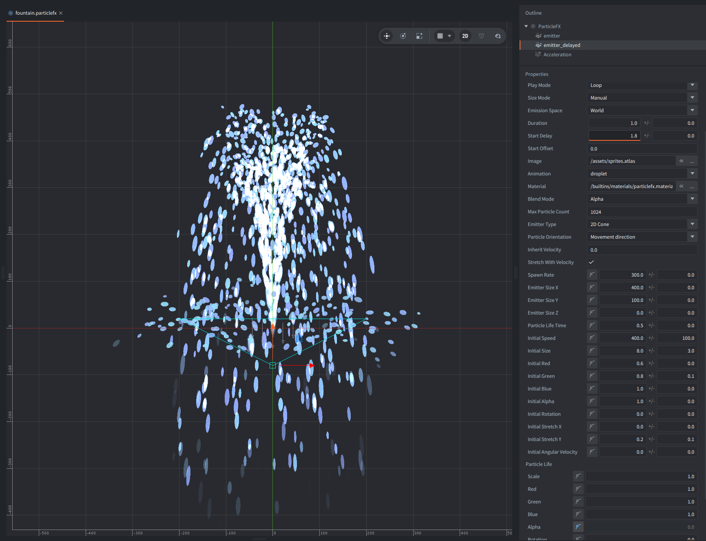

This example shows how `Start Delay` can be used to coordinate multiple emitters inside a single ParticleFX. The effect is a simple fountain: one emitter shoots water droplets upward, and another emitter near the bottom creates a small splash when those droplets come back down.

## Setup

The collection contains a single game object with:

1. ParticleFX component `#fountain` using `fountain.particlefx`
2. Script `fountain.script` that starts the effect in `init()` with `particlefx.play("#fountain")`.
3. GUI component `description` with text instructions.

The particle effect itself contains two emitters:

1. The first emitter starts immediately and creates the main water jet. It is a narrow 2D cone with high initial speed, so the particles travel upward first.
2. The second emitter is placed lower, near the bottom of the fountain, and has `Start Delay` set to `1.8`. It uses a much wider emission shape and a shorter particle lifetime to create the impression of droplets bouncing and splashing when the first particles reach the basin area.

A single `Acceleration` modifier with downward direction is shared by the whole effect. It pulls particles downward, simulating gravity, which makes the main jet arc back and helps the delayed splash particles fall off naturally.

## How It Works

When the ParticleFX starts, the first emitter begins spawning droplets immediately. Because the particles are given a strong upward speed and are affected by downward acceleration, they rise, slow down, and then fall back.

The second emitter does not emit right away. Its `Start Delay` is tuned so it begins around the same time the first droplets return to the bottom. This makes the splash feel connected to the main jet even though it is authored as a separate emitter.

Using `Start Delay` this way is useful when one effect should have multiple phases, such as launch and impact, fire followed by smoke, or a fountain spray followed by a delayed splash, without having to coordinate several ParticleFX components from code.
